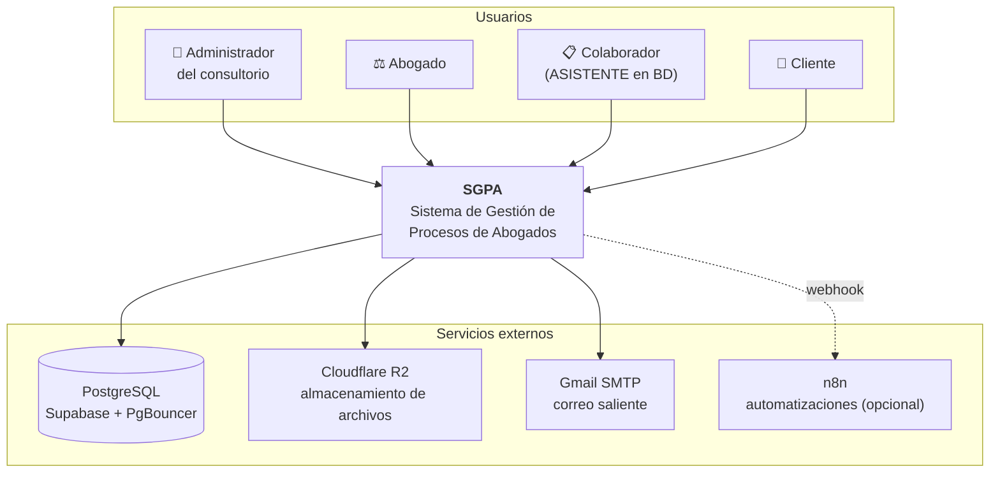
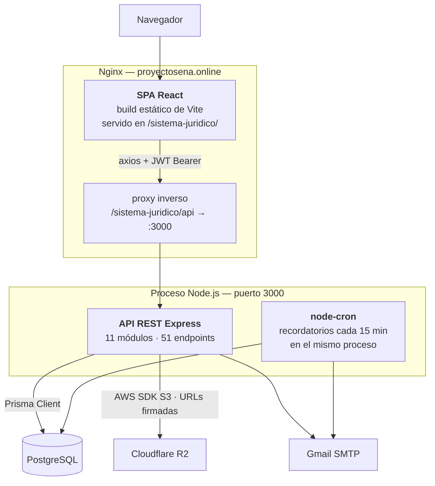
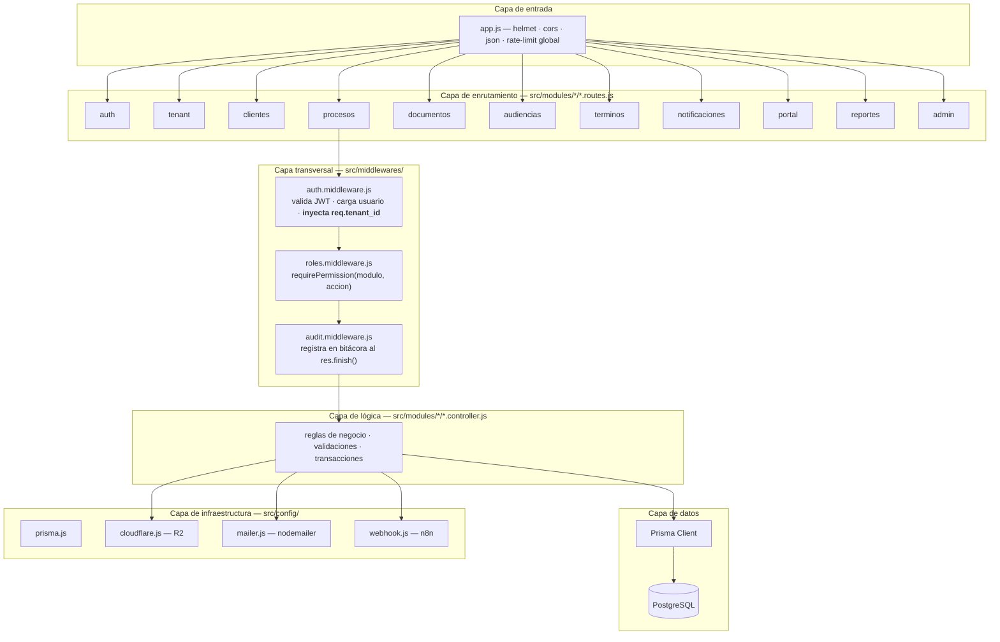
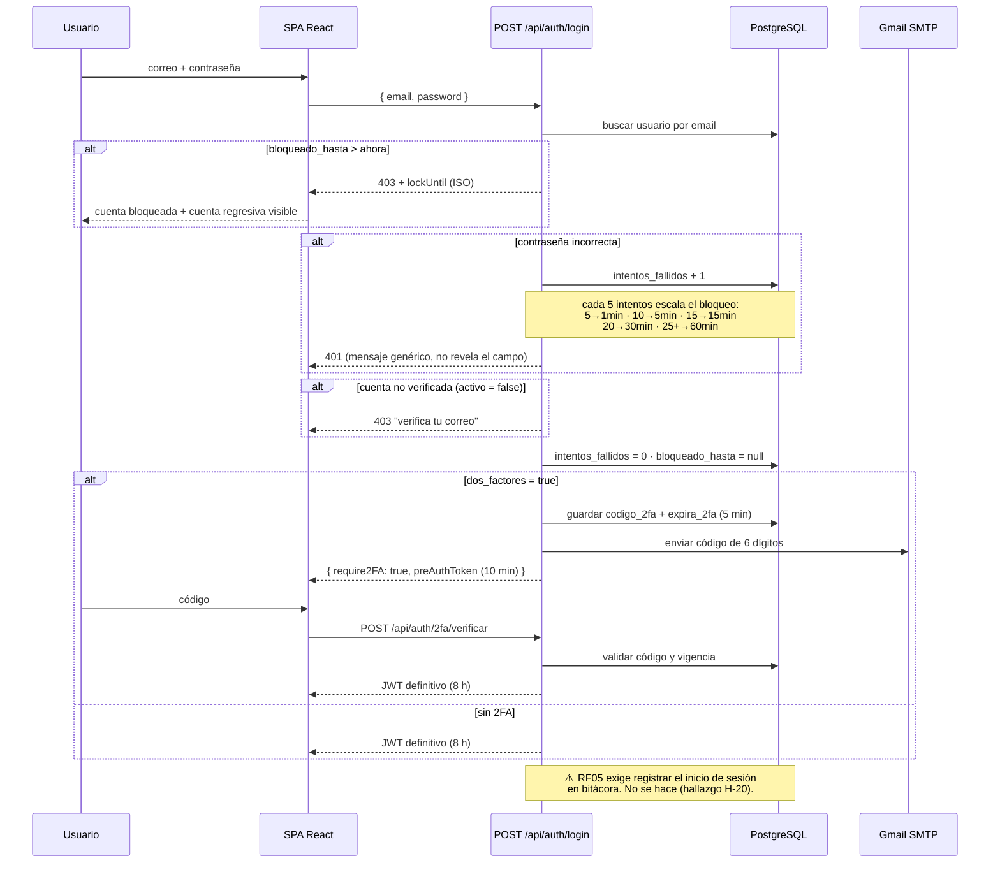
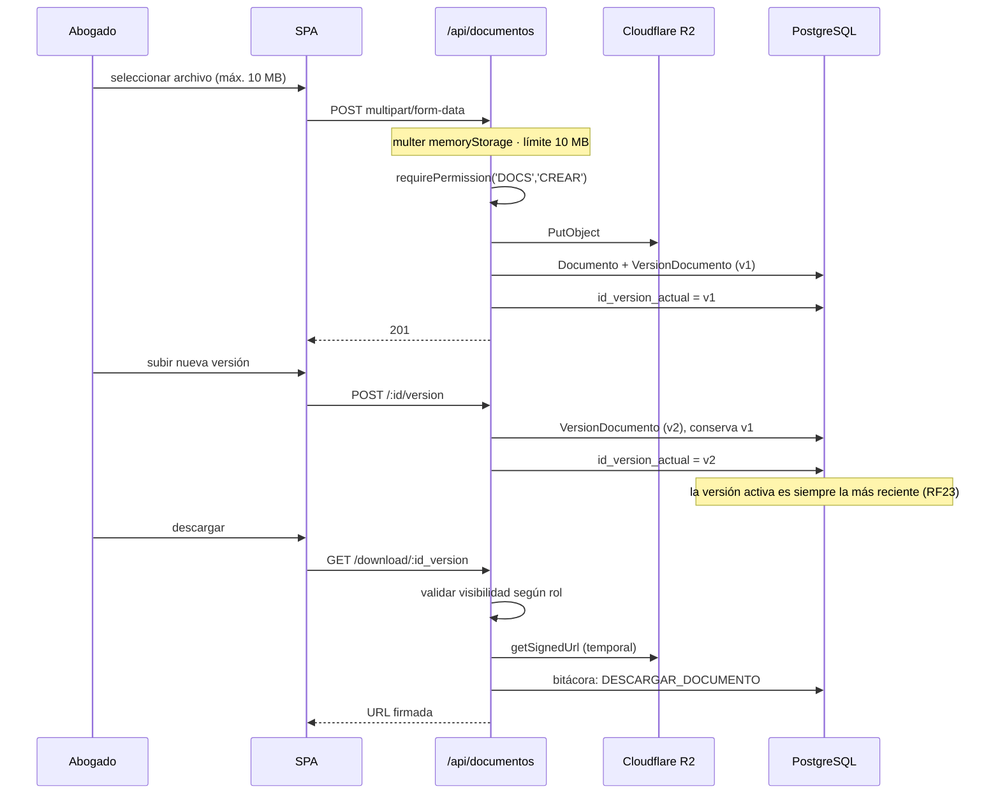
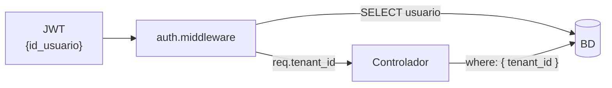
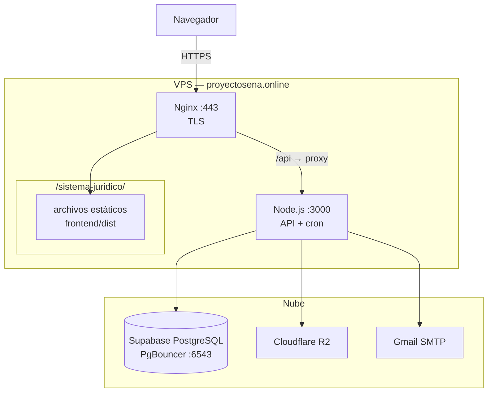

# 01 — Arquitectura del SGPA

**Documento vigente.** Sustituye a `docs/historico/arquitectura.md` y a `docs/historico/especificaciones_tecnicas.md`.
Describe el sistema **tal como está construido**, verificado contra el código en el commit `7ebf5c4`.

---

## 1. La pregunta de fondo: ¿MVC o monolito modular?

La documentación anterior nunca respondió esto, y las dos respuestas que insinuaba
("microservicios lógicos" y "MVC") eran incorrectas. La respuesta precisa es:

> El SGPA es un **monolito modular desplegado como dos artefactos**
> (una SPA estática y una API REST), organizado internamente **por módulos de dominio**,
> y dentro de cada módulo **por capas**.

Vale la pena desarmar la afirmación, porque cada parte importa:

**Monolito** — Todo el backend corre en **un solo proceso Node.js** (`backend/server.js`),
con **una sola conexión a base de datos** (`src/config/prisma.js`) y **un solo despliegue**.
No hay servicios independientes, ni cola de mensajes, ni API gateway. Es lo correcto para
este tamaño de sistema, y llamarlo "microservicios" era un error.

**Modular** — El backend **no** está organizado por tipo técnico de archivo
(la estructura clásica `controllers/`, `routes/`, `models/`), sino **por dominio de negocio**.
Cada carpeta bajo `src/modules/` es una unidad funcional autocontenida:

```
src/modules/procesos/
    ├── procesos.routes.js       ← qué URLs expone y qué permisos exige
    └── procesos.controller.js   ← qué hace cada operación
```

Esto se llama *package by feature*. Su ventaja concreta aquí: para entender "expedientes"
se abren dos archivos contiguos, no seis carpetas distintas.

**Por capas** — Cada petición atraviesa siempre la misma secuencia de responsabilidades:

```
Router → Middlewares (auth → permisos → auditoría) → Controlador → Prisma ORM → PostgreSQL
```

**¿Y MVC?** No. MVC exige una capa *View* generada por el servidor; aquí el servidor solo
emite JSON y la vista vive en React, en otro artefacto. Lo que sí hay es la parte
`Controller` del patrón, y el `Model` delegado íntegramente a Prisma. Llamarlo MVC sería
tan impreciso como llamarlo microservicios.

**Lo que falta respecto a una arquitectura por capas canónica:** no existe una **capa de
servicios**. La lógica de negocio vive dentro de los controladores, que por eso son largos
(`procesos.controller.js`: 632 líneas; `documentos.controller.js`: 608). Es una deuda técnica
consciente y aceptable en este tamaño; se documenta como tal en [ADR-005](11-DECISIONES-ARQUITECTONICAS.md).

---

## 2. Vista de contexto



El cliente entra **por la misma aplicación** que el resto de usuarios; el sistema detecta
el rol `CLIENTE` y lo redirige a un layout distinto (`App.jsx: RootRedirect`). No hay
un segundo despliegue para el portal.

---

## 3. Vista de contenedores



**Detalle relevante y no documentado hasta ahora:** el planificador de recordatorios
(`src/jobs/recordatorios.job.js`) **no es un servicio aparte**. Vive dentro del mismo
proceso Express, arrancado desde `server.js`. Consecuencia operativa directa: si se escala
la API a varias instancias, **cada instancia enviará los mismos correos**. Ver
[ADR-007](11-DECISIONES-ARQUITECTONICAS.md).

---

## 4. Vista de capas del backend



### Orden de los middlewares y por qué es así

En cada router protegido el orden es **siempre** el mismo:

```js
router.use(authMiddleware);                                  // 1. ¿quién eres?
router.post('/', requirePermission('PROCESOS','CREAR'),      // 2. ¿puedes hacerlo?
                 auditMiddleware('PROCESOS'),                // 3. dejar rastro
                 procesosController.createProceso);          // 4. hacerlo
```

`auditMiddleware` se registra **antes** del controlador pero **actúa después**: se engancha
a `res.on('finish')` y solo escribe en bitácora si el método fue mutante y la respuesta fue 2xx
(`audit.middleware.js:9`). Es decir, no audita intentos fallidos — un matiz con consecuencias
para RNF03 que se documenta en el doc 03.

### Dos mecanismos de autorización coexistentes

| Mecanismo | Dónde | Qué hace |
|---|---|---|
| `requireRole([...])` | `auth.middleware.js` | Filtro grueso por rol. Usado en `/api/admin/*` y `PUT /api/tenant/perfil` |
| `requirePermission(mod, acc)` | `roles.middleware.js` | Filtro fino contra la tabla `permiso_rol`. Usado en los módulos de negocio |

`requirePermission` incorpora dos atajos importantes:
- `ADMINISTRADOR` **siempre** pasa, sin consultar la tabla de permisos.
- `CLIENTE` pasa en lectura sobre `DOCS`, `PROCESOS` y `PORTAL`; la propiedad del dato la valida después el controlador.

---

## 5. Flujo de autenticación (real, con 2FA y bloqueo progresivo)



**Contenido del JWT:** `{ id_usuario, tenant_id, rol }`, firmado con `JWT_SECRET`, vigencia `JWT_EXPIRES_IN` (8 h por defecto).

**Detalle de seguridad relevante:** `auth.middleware.js` **no confía en el `tenant_id` del token**.
Recarga el usuario desde la base de datos en cada petición y toma el `tenant_id` de ahí
(`req.tenant_id = user.tenant_id`). Eso hace que un token manipulado no pueda saltar de tenant,
y además permite que la desactivación de un usuario tenga efecto inmediato. Es una decisión
correcta, aunque cueste una consulta por petición.

---

## 6. Flujo documental (carga, versionado y descarga)



**Los binarios nunca pasan por el navegador vía la API.** La descarga se hace con una URL
firmada temporal contra R2, lo que cumple el criterio de RNF01 de *"ninguna solicitud de
archivo debe responderse sin token de sesión válido"*: la URL solo se emite tras validar
sesión, rol y visibilidad del documento.

**Visibilidad** (RF22): `PRIVADO`, `COMPARTIDO_CLIENTE`, `VISIBLE_COLAB`. La descarga desde
el portal del cliente se audita con una acción distinta (`DESCARGAR_DOCUMENTO_CLIENTE`),
lo que permite separar el rastro de accesos internos del de accesos del cliente.

---

## 7. Multi-tenancy

**Estrategia:** *tenancy por columna discriminadora* (una sola base de datos, un solo esquema,
columna `tenant_id` en cada tabla de negocio).



**Cobertura verificada:** 118 apariciones de `tenant_id` distribuidas en los 11 controladores.
El filtrado es sistemático.

**Limitaciones conocidas** (detalle en el hallazgo H-19):
1. El aislamiento se aplica **en el código de aplicación**, no en la base de datos. No hay
   *Row Level Security* de PostgreSQL. Un controlador nuevo que olvide el `where` filtra datos
   entre tenants sin que nada lo impida.
2. `Cliente.numero_documento` y `Proceso.numero_radicado` son únicos **globalmente**,
   lo que rompe el aislamiento por el lado de las restricciones.

---

## 8. Frontend

```
frontend/src/
├── App.jsx                    enrutado + ProtectedRoute + RootRedirect por rol
├── main.jsx                   punto de entrada
├── api/axios.js               instancia con interceptores (JWT + expulsión en 401)
├── context/AuthContext.jsx    única fuente de estado global (sesión)
├── components/
│   ├── layout/                DashboardLayout · PortalLayout
│   └── ui/                    primitivas shadcn: button, card, input, label, sonner
├── pages/                     17 páginas agrupadas por dominio
└── index.css                  tema, variables y utilidades
```

**Gestión de estado:** solo `AuthContext` es global. Todo lo demás es estado local con
`useState` y peticiones directas con `axios`. **No hay React Query, Redux ni Zustand.**
Es una decisión válida para este tamaño; su coste es que varias páginas repiten el patrón
`useEffect` + `loading` + `try/catch`.

**Protección de rutas:** `ProtectedRoute` en `App.jsx` valida sesión y rol en cliente.
Es defensa en profundidad, no seguridad: la autorización real la impone el backend.

**Despliegue en subcarpeta:** `vite.config.js` fija `base: '/sistema-juridico/'` y
`App.jsx` fija `basename="/sistema-juridico"`. Todo enlace absoluto debe construirse con
`import.meta.env.BASE_URL` (así lo hace `api/axios.js` en la redirección por 401). Olvidarlo
produce un 404 de Nginx — exactamente el bug corregido en el commit `a21030f`.

**Diseño visual — no tocar.** Tema oscuro `#0a0a0c` con acento dorado `#DFB971`,
*glassmorphism* (`backdrop-blur` + bordes `white/10`), tipografía Geist. Es coherente,
está bien ejecutado y es adecuado para el sector jurídico. Ninguna recomendación de este
conjunto de documentos implica modificarlo.

---

## 9. Vista de despliegue



**Base de datos:** `DATABASE_URL` apunta al *pooler* (PgBouncer, puerto 6543) para las
consultas; `DIRECT_URL` apunta al puerto 5432 para las migraciones, que no funcionan a
través del pooler.

**Integración continua:** `.github/workflows/ci.yml` ejecuta Jest (backend) y Cypress
(frontend) sobre **Node 22**. Discrepancia con el Node 24 local — ver el doc 09.

---

## 10. Resumen de decisiones estructurales

| Aspecto | Decisión real |
|---|---|
| Estilo arquitectónico | Monolito modular, dos artefactos desplegables |
| Organización del backend | Por dominio (*package by feature*), capas dentro de cada módulo |
| Patrón por petición | Router → Middlewares → Controlador → Prisma → PostgreSQL |
| Capa de servicios | **No existe**; la lógica vive en los controladores |
| Multi-tenancy | Columna `tenant_id`, aplicada en aplicación (sin RLS) |
| Autenticación | JWT sin estado, 8 h, con verificación del usuario en cada petición |
| Autorización | Dos niveles: rol grueso + permisos finos por módulo/acción |
| Auditoría | Middleware genérico + escrituras explícitas en los controladores |
| Almacenamiento | Cloudflare R2 con URLs firmadas temporales |
| Tareas programadas | `node-cron` dentro del proceso de la API |
| Frontend | SPA React 19 + Vite 8, estado local + un solo contexto |
