# 02 — Modelo de datos

**Documento vigente.** Sustituye a `docs/fuentes/diagrama_db.txt`.
Derivado directamente de `backend/prisma/schema.prisma` (commit `7ebf5c4`).
**17 entidades · 16 enumeraciones · PostgreSQL 15+ · Prisma ORM 5.22**

---

## 1. Diagrama entidad-relación

```mermaid
erDiagram
    TENANTS ||--o{ USUARIO : "agrupa"
    TENANTS ||--o{ CLIENTES : "posee"
    TENANTS ||--o{ PROCESOS : "posee"
    TENANTS ||--o{ DOCUMENTOS : "posee"
    TENANTS ||--o{ AUDIENCIAS : "posee"
    TENANTS ||--o{ TERMINOS_JUDICIALES : "posee"
    TENANTS ||--o{ PARTES_PROCESALES : "posee"
    TENANTS ||--o{ NOTIFICACIONES : "posee"
    TENANTS ||--o{ BITACORA_AUDITORIA : "posee"
    TENANTS ||--o{ HISTORIAL_PROCESO : "posee"

    USUARIO ||--o{ PERMISO_ROL : "tiene"
    USUARIO ||--o{ CLIENTES : "registra"
    USUARIO ||--o{ PROCESOS : "es responsable de"
    USUARIO ||--o{ PROCESO_ABOGADOS : "colabora en"
    USUARIO ||--o{ DOCUMENTOS : "sube"
    USUARIO ||--o{ VERSIONES_DOCUMENTOS : "sube version"
    USUARIO ||--o{ AUDIENCIAS : "crea"
    USUARIO ||--o{ TERMINOS_JUDICIALES : "crea y gestiona"
    USUARIO ||--o{ NOTIFICACIONES : "recibe"
    USUARIO ||--o{ BITACORA_AUDITORIA : "genera"
    USUARIO ||--o{ HISTORIAL_PROCESO : "realiza"

    CLIENTES ||--o{ PROCESOS : "es parte en"

    PROCESOS ||--o{ PROCESO_ABOGADOS : "equipo"
    PROCESOS ||--o{ PARTES_PROCESALES : "sujetos"
    PROCESOS ||--o{ DOCUMENTOS : "expediente"
    PROCESOS ||--o{ AUDIENCIAS : "agenda"
    PROCESOS ||--o{ TERMINOS_JUDICIALES : "plazos"
    PROCESOS ||--o{ HISTORIAL_PROCESO : "trazabilidad"
    PROCESOS ||--o{ ACTUACIONES : "cronologia procesal"
    ACTUACIONES ||--o{ TERMINOS_JUDICIALES : "origina"
    TENANTS ||--o{ ACTUACIONES : "posee"
    USUARIO ||--o{ ACTUACIONES : "registra"

    DOCUMENTOS ||--o{ VERSIONES_DOCUMENTOS : "versiona"
    DOCUMENTOS }o--|| VERSIONES_DOCUMENTOS : "version actual"

    AUDIENCIAS ||--o{ RECORDATORIOS_AUDIENCIA : "alerta"
    TERMINOS_JUDICIALES ||--o{ RECORDATORIOS_TERMINO : "alerta"

    TENANTS {
        uuid id_tenant PK
        varchar nombre
        enum tipo "CONSULTORIO|INDEPENDIENTE"
        varchar razon_social "opcional"
        varchar nit "opcional"
        varchar email_admin
        enum plan "BASICO|PRO, opcional"
        boolean activo
        text logo_url "opcional"
        varchar telefono "opcional"
        text direccion "opcional"
        varchar ciudad "opcional"
        int horas_ocultar_notificaciones "default 48 - RF41"
        timestamp created_at
    }

    USUARIO {
        uuid id_usuario PK
        uuid tenant_id FK
        varchar nombre
        varchar email UK "unico GLOBAL - ver H-19"
        varchar nombre_usuario UK "opcional, unico GLOBAL - RF01.2"
        text password_hash "bcrypt salt 10"
        enum rol "ADMINISTRADOR|ABOGADO|ASISTENTE|CLIENTE"
        boolean activo "false hasta verificar correo"
        boolean dos_factores
        int intentos_fallidos "RNF02"
        timestamp bloqueado_hasta "RNF02, opcional"
        varchar codigo_2fa "OTP 6 digitos, opcional"
        timestamp expira_2fa "5 min, opcional"
        varchar token_verificacion "RF54, opcional"
        enum preferencia_canal "PLATAFORMA|EMAIL|AMBOS"
        enum pref_prioridad_audiencia "default MEDIA"
        enum pref_prioridad_termino "default ALTA"
        enum pref_prioridad_tarea "default BAJA"
        timestamp create_at
    }

    PERMISO_ROL {
        uuid id_permiso PK
        uuid id_usuario FK
        enum modulo "PROCESOS|DOCS|CLIENTES|AUDIENCIAS|TERMINO|REPORTES|PORTAL"
        boolean puede_leer
        boolean puede_crear
        boolean puede_editar
        boolean puede_eliminar
    }

    CLIENTES {
        uuid id_cliente PK
        uuid tenant_id FK
        enum tipo "NATURAL|JURIDICA"
        varchar nombre
        varchar razon_social "opcional"
        varchar tipo_documento
        varchar numero_documento UK "unico POR CONSULTORIO desde 02-09-2026"
        varchar nit "opcional"
        varchar representante "opcional"
        varchar telefono
        varchar email
        text direccion "opcional"
        date fecha_nacimiento "opcional"
        uuid id_usuario FK "quien lo registro"
        timestamp create_at
    }

    PROCESOS {
        uuid id_proceso PK
        uuid tenant_id FK
        varchar numero_radicado UK "unico POR CONSULTORIO desde 02-09-2026"
        varchar juzgado "opcional"
        varchar tipo_proceso
        varchar clase_proceso "opcional"
        varchar area_derecho "opcional"
        enum estado "ACTIVO|SUSPENDIDO|ARCHIVADO|FINALIZADO"
        date fecha_radicado "opcional"
        uuid id_cliente FK
        uuid id_abogado_resp FK
        timestamp create_at
        timestamp update_at
    }

    PROCESO_ABOGADOS {
        uuid id_proceso PK_FK
        uuid id_usuario PK_FK
        enum rol_en_proceso "ABOGADO|ASISTENTE"
        timestamp asigned_at
    }

    PARTES_PROCESALES {
        uuid id_procesal PK
        uuid tenant_id FK
        uuid id_proceso FK
        varchar nombre
        enum tipo "DEMANDANTE|DEMANDADO|VICTIMA|TERCEROS|CLIENTE|OTRO"
        varchar id_documento "opcional"
        timestamp created_at
    }

    DOCUMENTOS {
        uuid id_documento PK
        uuid tenant_id FK
        uuid id_proceso FK "opcional - RF21"
        varchar nombre
        enum categoria "6 valores - falta ESCRITO, ver H-18"
        enum visibilidad "PRIVADO|COMPARTIDO_CLIENTE|VISIBLE_COLAB"
        enum estado "ACTIVO|INACTIVO|REEMPLAZADO"
        uuid id_version_actual FK "opcional"
        uuid subido_por FK
        timestamp created_at
    }

    VERSIONES_DOCUMENTOS {
        uuid id_version PK
        uuid id_documento FK
        int numero_version
        text url_archivo "clave en R2"
        varchar nombre_archivo "255 - el diagrama antiguo decia 20"
        int tamano_bytes
        varchar formato
        uuid subido_por FK
        timestamp created_at
    }

    AUDIENCIAS {
        uuid id_audiencia PK
        uuid tenant_id FK
        uuid id_proceso FK
        varchar nombre
        varchar tipo
        timestamp fecha_hora
        varchar lugar
        enum estado "PROGRAMADA|REALIZADA|CANCELADA"
        uuid created_by FK
        timestamp created_at
    }

    RECORDATORIOS_AUDIENCIA {
        uuid id_recordatorio PK
        uuid id_audiencia FK
        int minutos_antes
        enum canal "PLATAFORMA|EMAIL|AMBOS"
        boolean enviado
        timestamp fecha_envio "opcional"
    }

    ACTUACIONES {
        uuid id_actuacion PK
        uuid tenant_id FK
        uuid id_proceso FK
        date fecha_actuacion "cuando ocurrio en el juzgado"
        enum tipo "catalogo cerrado de 10 valores"
        text anotacion
        timestamp fecha_registro "cuando se digito en el sistema"
        uuid registrado_por FK
    }

    TERMINOS_JUDICIALES {
        uuid id_termino PK
        uuid tenant_id FK
        uuid id_proceso FK
        uuid id_actuacion FK "opcional - actuacion que lo origino"
        varchar nombre
        timestamp fecha_vencimiento
        boolean es_critico "RF37"
        enum estado "PENDIENTE|CUMPLIDO|CUMPLIDO_TARDIO|INCUMPLIDO"
        uuid gestionado_por FK "opcional"
        timestamp fecha_gestion "opcional"
        text justificacion "opcional"
        uuid created_by FK
        timestamp created_at
    }

    RECORDATORIOS_TERMINO {
        uuid id_recordatorio PK
        uuid id_termino FK
        timestamp fecha_hora_envio
        enum canal "PLATAFORMA|EMAIL|AMBOS"
        boolean enviado
        timestamp fecha_envio_real "opcional"
    }

    NOTIFICACIONES {
        uuid id_notificacion PK
        uuid tenant_id FK
        uuid id_usuario FK
        varchar titulo
        text mensaje
        enum prioridad "ALTA|MEDIA|BAJA"
        boolean leida
        boolean gestionada
        varchar referencia_tipo "TERMINO|AUDIENCIA|..."
        uuid id_referencia
        timestamp created_at
        timestamp updated_at "base del ocultado a las 48h"
    }

    BITACORA_AUDITORIA {
        uuid id_bitacora PK
        uuid tenant_id FK
        uuid id_usuario FK
        varchar accion
        varchar modulo
        text detalle
        varchar ip_adress "sic - typo en el esquema"
        timestamp create_at
    }

    HISTORIAL_PROCESO {
        uuid id_historial PK
        uuid tenant_id FK
        uuid id_proceso FK
        varchar campo_modificado
        text valor_anterior "opcional"
        text valor_nuevo "opcional"
        varchar accion
        uuid realizado_por FK
        timestamp created_at
    }
```



---

## 2. Las 15 enumeraciones

| Enum | Valores | Requisito que lo respalda |
|---|---|---|
| `TipoTenant` | `CONSULTORIO`, `INDEPENDIENTE` | RF51 |
| `PlanTenant` | `BASICO`, `PRO` | — (comercial, sin RF asociado) |
| `RolUsuario` | `ADMINISTRADOR`, `ABOGADO`, `ASISTENTE`, `CLIENTE` | RF02 (usa "Colaborador" — ver H-09) |
| `ModuloPermiso` | `PROCESOS`, `DOCS`, `CLIENTES`, `AUDIENCIAS`, `TERMINO`, `REPORTES`, `PORTAL` | RF03 |
| `TipoCliente` | `NATURAL`, `JURIDICA` | RF06 |
| `EstadoProceso` | `ACTIVO`, `SUSPENDIDO`, `ARCHIVADO`, `FINALIZADO` | RF13 |
| `RolProcesoAbogado` | `ABOGADO`, `ASISTENTE` | RF12 |
| `TipoParte` | `DEMANDANTE`, `DEMANDADO`, `VICTIMA`, `TERCEROS`, `CLIENTE`, `OTRO` | RF15 |
| `TipoActuacion` | `AUTO`, `SENTENCIA`, `NOTIFICACION`, `AUDIENCIA`, `MEMORIAL`, `DEMANDA`, `CONTESTACION`, `RECURSO`, `TRASLADO`, `OTRO` | **RF56 (nuevo)** |
| `CategoriaDocumento` | `DEMANDA`, `PRUEBA`, `CONTRATO`, `ESCRITO`, `NOTIFICACION`, `PROVIDENCIA`, `OTRO` | RF19 — las siete, desde el 3-09-2026 |
| `VisibilidadDocumento` | `PRIVADO`, `COMPARTIDO_CLIENTE`, `VISIBLE_COLAB` | RF22 |
| `EstadoDocumento` | `ACTIVO`, `INACTIVO`, `REEMPLAZADO` | RF26, RN06 |
| `EstadoAudiencia` | `PROGRAMADA`, `REALIZADA`, `CANCELADA` | RF31 |
| `CanalNotificacion` | `PLATAFORMA`, `EMAIL`, `AMBOS` | RF47 |
| `EstadoTermino` | `PENDIENTE`, `CUMPLIDO`, `CUMPLIDO_TARDIO`, `INCUMPLIDO` | RF35, RN07 |
| `PrioridadNotificacion` | `ALTA`, `MEDIA`, `BAJA` | RF48 |

---

## 3. Decisiones de modelado que conviene entender

### 3.1 Doble mecanismo de trazabilidad

El sistema tiene **dos bitácoras distintas y complementarias**:

| | `bitacora_auditoria` | `historial_proceso` |
|---|---|---|
| **Ámbito** | Todo el sistema | Un expediente concreto |
| **Lectores** | Administrador (pantalla de Auditoría) | Cualquiera con acceso al expediente |
| **Contenido** | acción, módulo, IP, detalle | campo modificado, valor anterior, valor nuevo |
| **Propósito** | Cumplimiento y seguridad (RNF03, RN01) | Trazabilidad procesal (RF14, HU-10) |

No es duplicación: responden a preguntas diferentes. La bitácora responde *"¿quién hizo qué en
el sistema?"*; el historial responde *"¿cómo evolucionó este caso?"*. Muchas operaciones
escriben en ambas.

### 3.1.b Actuación frente a historial: dos cosas que parecen una

A las dos bitácoras de la sección anterior se suma una tercera tabla que registra hechos,
y conviene no confundirla con ellas:

| | `historial_proceso` | `actuaciones` |
|---|---|---|
| Qué registra | Que un **usuario cambió algo en el sistema** | Que el **juzgado hizo algo en el proceso** |
| Fecha relevante | Cuándo se editó en la aplicación | `fecha_actuacion`: cuándo ocurrió en el juzgado |
| Quién lo genera | El sistema, automáticamente | Una persona, digitando del portal judicial |
| Se puede corregir | No | Sí (`PUT /api/actuaciones/:id`), dejando rastro |

La `Actuacion` es además el **origen de los términos**: `TerminoJudicial.id_actuacion`
reconstruye la cadena actuación → término → alerta. El vínculo es opcional porque RF32
permite registrar términos sueltos. Ver [ADR-010](11-DECISIONES-ARQUITECTONICAS.md).

### 3.2 La versión activa de un documento

`Documento.id_version_actual` es una clave foránea hacia `VersionDocumento`, que a su vez
apunta de vuelta a `Documento`. Es una **referencia circular deliberada** que permite obtener
la versión vigente sin ordenar toda la colección de versiones. Prisma la resuelve con dos
relaciones nombradas (`VersionActual` y `VersionesDocumento`).

### 3.3 Dos modelos de recordatorio, no uno

`RecordatorioAudiencia` guarda **`minutos_antes`** (desplazamiento relativo);
`RecordatorioTermino` guarda **`fecha_hora_envio`** (instante absoluto).

No es una inconsistencia: es exactamente lo que piden los requisitos. RF28 define los
recordatorios de audiencia como intervalos ("48 h antes"), lo que permite **recalcularlos
automáticamente al reprogramar** (HU-19). RF37 define los de término con fecha y hora
configurables. La diferencia de modelado refleja una diferencia real del dominio.

### 3.4 Eliminación lógica frente a eliminación física

- **Documentos:** nunca se borran de verdad en el flujo normal. Pasan a `INACTIVO` o
  `REEMPLAZADO`, y `RN06` prohíbe reactivarlos. Existe un borrado definitivo restringido
  al Administrador (`DELETE /api/documentos/:id/definitivo`).
- **Expedientes:** `deleteProcesoDefinitivo` sí borra en cascada dentro de una transacción,
  pero solo tras verificar que no queden documentos activos ni términos pendientes, y exige
  justificación escrita que se guarda en bitácora (RNF06, HU-34).
- **Bitácora:** **jamás** se borra ni se edita. RN01 la declara invariante absoluta. El código
  respeta esto: no existe ningún `update` ni `delete` sobre `bitacoraAuditoria` en todo el backend.

---

## 4. Diferencias frente a `diagrama_db.txt`

| Diferencia | Diagrama antiguo | Esquema real | Veredicto |
|---|---|---|---|
| `Tenant.horas_ocultar_notificaciones` | ausente | `Int @default(48)` | Falta en el diagrama |
| `Usuario` — 9 campos de seguridad y preferencias | ausentes | presentes | Faltan en el diagrama |
| `Proceso.update_at` | ausente | `@updatedAt` | Falta en el diagrama |
| `Notificacion.updated_at` | ausente | `@updatedAt` | Falta en el diagrama |
| `versiones_documentos.nombre_archivo` | `varchar(20)` | `VarChar(255)` | Diagrama incorrecto |
| `categoria` de documento | 6 valores | 6 valores | Ambos incumplen RF19 (7) |
| Nombre de la tabla de usuarios | `usuario` (singular) | `@@map("usuario")` | Coinciden |

---

## 5. Deuda técnica del modelo

Priorizada. El detalle de ejecución está en [10-PLAN-DE-REMEDIACION.md](10-PLAN-DE-REMEDIACION.md).

| # | Problema | Impacto | Corrección |
|---|---|---|---|
| 1 | ~~`numero_documento` y `numero_radicado` únicos globalmente~~ | ~~**Alto** — rompe el aislamiento entre tenants (H-19)~~ | ✅ **CORREGIDO** el 2-09-2026, migración `unicidad_por_consultorio`. Ver [doc 14 § D-04](14-AUDITORIA-DE-DEFECTOS.md) |
| 2 | ~~Sin índices explícitos en `tenant_id` ni en campos de búsqueda~~ | ~~**Medio** — RNF05 exige respuesta < 2 s; sin índice, cada búsqueda es un recorrido secuencial~~ | ✅ **CORREGIDO** el 3-09-2026, migración `indices_de_busqueda`: once índices, cinco de ellos GIN de trigramas. Verificable con `npm run verificar:indices` |
| 3 | ~~Falta el valor `ESCRITO` en `CategoriaDocumento`~~ | ~~Bajo~~ | ✅ **CORREGIDO** el 3-09-2026, migración `categoria_escrito` |
| 4 | `ip_adress` está mal escrito (falta la `d`: *address*) | Cosmético | Renombrar con `@map("ip_adress")` para no romper la columna existente |
| 5 | `create_at` / `created_at` inconsistentes entre tablas | Cosmético | Unificar en `created_at` vía `@map` |
| 6 | `token_verificacion` sin fecha de emisión | **Medio** — impide cumplir la vigencia de 24 h de RF54 | Añadir `token_verificacion_expira DateTime?` |
| 7 | Sin *Row Level Security* en PostgreSQL | Medio — el aislamiento depende solo del código | Evaluar RLS; ver [ADR-003](11-DECISIONES-ARQUITECTONICAS.md) |
| 8 | `PermisoRol` sin restricción única `(id_usuario, modulo)` | Medio — permite filas duplicadas y `findFirst` devolvería una arbitraria | `@@unique([id_usuario, modulo])` |

### Sobre el punto 2 — el índice que más faltaba, y cómo se resolvió

`getProcesos` construye consultas con `contains` sobre `numero_radicado`, `juzgado`,
`cliente.nombre`, `cliente.razon_social` y `abogado_resp.nombre`. Con volúmenes pequeños
funcionaba —entre 5 y 17 ms— pero por el tamaño de los datos, no por el diseño: cada búsqueda era
un recorrido secuencial. Con miles de expedientes por tenant, RNF05 (< 2 s) habría dejado de
cumplirse.

Se resolvió el 3 de septiembre de 2026 con once índices. Los seis corrientes:

```prisma
model Proceso {
  // ...
  @@index([tenant_id, create_at(sort: Desc)])   // listado paginado
  @@index([tenant_id, estado])                  // filtro de RNF05
  @@index([tenant_id, tipo_proceso])            // filtro de RNF05
  @@index([id_abogado_resp])                    // qué ve quien no es Administrador
}
```

**Y los cinco de texto, que no podían ser B-tree.** La búsqueda parcial es `ILIKE '%texto%'`, con
comodín por delante: un B-tree ordena por prefijo y aquí no hay prefijo, así que el índice
existiría y no se usaría jamás. Son GIN de trigramas sobre `procesos.numero_radicado`,
`procesos.juzgado`, `clientes.nombre`, `clientes.razon_social` y `usuario.nombre`:

```prisma
@@index([numero_radicado(ops: raw("gin_trgm_ops"))], type: Gin)
```

Requieren la extensión `pg_trgm`, que la migración instala. Es la razón de que esta vaya en un
archivo aparte y sea la última de las tres: si el usuario de base de datos del despliegue no puede
crear extensiones, falla sola y las otras dos ya están aplicadas.

> **Por qué el umbral de 3 caracteres deja de ser cosmético.** Tres es el tamaño del trigrama. Con
> dos, el índice no puede acotar nada y la consulta vuelve a recorrer la tabla. El límite que
> `getProcesos` ya aplicaba por usabilidad pasa a ser parte de la garantía de rendimiento.
