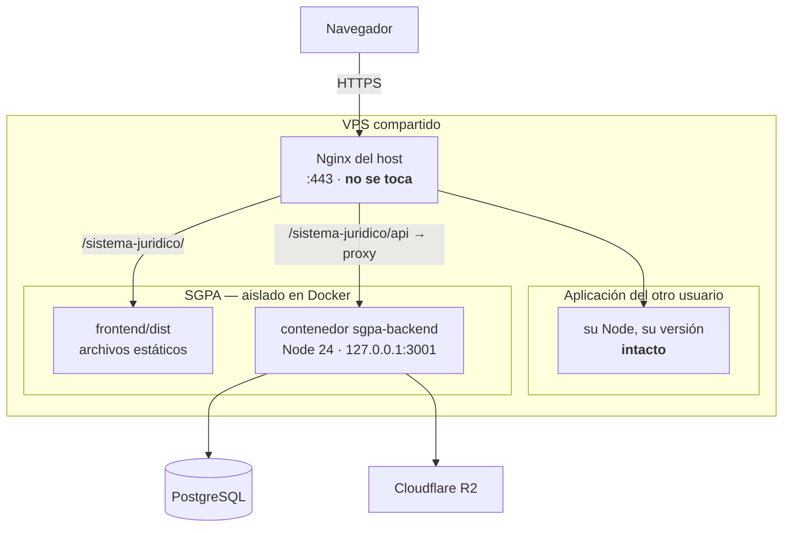

# 12 — Despliegue en VPS compartido con Docker

**Problema que resuelve este documento.** El VPS está compartido con otro usuario. Cuando se
actualiza Node.js —o cualquier otra dependencia del sistema— para que funcione el SGPA, **la
aplicación del otro usuario se cae**, porque trabajaba con la versión anterior. Y al revés.

La causa es que ambas aplicaciones comparten un único Node instalado a nivel de sistema.
Mientras eso siga así, cada actualización es una apuesta.

**La solución adoptada:** meter el SGPA en contenedores. La versión de Node deja de vivir en
el VPS y pasa a vivir dentro de la imagen del SGPA. Actualizarla se convierte en cambiar una
línea de un archivo y reconstruir; el resto del servidor ni se entera.

> Decisión registrada en [ADR-011](11-DECISIONES-ARQUITECTONICAS.md).

---

## 1. Cómo queda el servidor



**Lo importante:** el Nginx del host se conserva tal cual y sigue sirviendo también a la otra
aplicación. Este montaje **no toma control del servidor web**; solo añade un contenedor que
escucha en `127.0.0.1` y un directorio de archivos estáticos.

Y el frontend **también se compila dentro de un contenedor**. Ese es el detalle que cierra el
problema: si compilaras en el VPS necesitarías Node instalado allí, y volverías al punto de
partida.

---

## 2. Archivos que componen el montaje

| Archivo | Para qué sirve |
|---|---|
| `backend/Dockerfile` | Imagen de la API. Fija la versión de Node y genera el cliente de Prisma para el sistema operativo del contenedor |
| `backend/.dockerignore` | Impide que `node_modules` del portátil y el `.env` entren en la imagen |
| `frontend/Dockerfile` | Contenedor **de compilación**. Produce `dist/` y lo vuelca en un volumen |
| `frontend/.dockerignore` | Igual, para el frontend |
| `docker-compose.yml` | Orquesta ambos: el backend queda corriendo, el frontend se ejecuta bajo demanda |

---

## 3. Preparación (una sola vez)

### 3.1 Instalar Docker en el VPS

Requiere `sudo` una única vez. A partir de ahí, el despliegue no necesita privilegios.

```bash
curl -fsSL https://get.docker.com | sudo sh
sudo usermod -aG docker $USER
```

Cierra la sesión SSH y vuelve a entrar para que el grupo tenga efecto. Comprueba:

```bash
docker --version && docker compose version
```

> **Cortesía con el otro usuario:** instalar Docker no altera su aplicación —no toca su Node,
> ni sus librerías, ni su configuración de Nginx—, pero sí es un cambio a nivel de sistema.
> Conviene avisarle antes.

### 3.2 Preparar el `.env` del backend

```bash
cd ~/sistema-juridico/backend
cp .env.example .env
nano .env
```

Rellena `DATABASE_URL`, `DIRECT_URL`, `JWT_SECRET`, las tres `R2_*`, `GMAIL_*` y
`FRONTEND_URL`. **Deja `PORT=3000`**: ese es el puerto *dentro* del contenedor; el que se
publica hacia el host se controla desde `docker-compose.yml`.

### 3.3 Elegir el puerto del host

Por defecto es el **3001**. Si está ocupado por la otra aplicación, cámbialo sin tocar el
compose creando un `.env` en la raíz del proyecto:

```bash
echo "SGPA_PUERTO=3005" > ~/sistema-juridico/.env
```

Para saber qué puertos están libres:

```bash
ss -tlnp
```

---

## 4. Desplegar

```bash
cd ~/sistema-juridico
git pull

# 1. Construir y levantar la API
docker compose up -d --build backend

# 2. Aplicar los cambios de esquema a la base de datos
#    (ver la advertencia del apartado 6 antes de la primera vez)
docker compose exec backend npx prisma db push

# 3. Compilar el frontend — el contenedor se borra al terminar
docker compose --profile build run --rm frontend-build
```

Comprobar que la API responde:

```bash
curl http://127.0.0.1:3001/
# {"message":"SGPA API is running"}
```

---

## 5. Configuración de Nginx en el host

Añade estos dos bloques dentro del `server { ... }` que ya tienes. **No sustituyas tu
configuración**: solo agrega lo que falta, para no romper a la otra aplicación.

```nginx
# API del SGPA → contenedor
location /sistema-juridico/api/ {
    proxy_pass         http://127.0.0.1:3001/api/;
    proxy_http_version 1.1;
    proxy_set_header   Host              $host;
    proxy_set_header   X-Real-IP         $remote_addr;
    proxy_set_header   X-Forwarded-For   $proxy_add_x_forwarded_for;
    proxy_set_header   X-Forwarded-Proto $scheme;

    # Subida de documentos: el backend acepta hasta 10 MB
    client_max_body_size 12M;
}

# Frontend del SGPA → archivos estáticos
location /sistema-juridico/ {
    alias /home/TU_USUARIO/sistema-juridico/frontend/dist/;
    try_files $uri $uri/ /sistema-juridico/index.html;
}
```

Validar **antes** de recargar, para no dejar el servidor caído:

```bash
sudo nginx -t && sudo systemctl reload nginx
```

> **Tres detalles que suelen fallar:**
> 1. La barra final en `proxy_pass http://127.0.0.1:3001/api/;` es obligatoria. Sin ella, la
>    ruta se concatena mal y todo devuelve 404.
> 2. `try_files ... /sistema-juridico/index.html` es lo que hace funcionar el enrutado de React
>    al recargar una página interna. Es el equivalente al `vercel.json` que se retiró.
> 3. Nginx necesita permiso de lectura sobre `frontend/dist`. Si da 403, revisa los permisos
>    de tu carpeta personal (`chmod o+x /home/TU_USUARIO`).

---

## 6. ⚠️ La primera migración: no uses `migrate deploy`

Ver también [10-PLAN-DE-REMEDIACION.md](10-PLAN-DE-REMEDIACION.md).

La migración `20260901203729_agregar_actuaciones` se generó contra una base **vacía**, así que
crea el esquema completo. Tu base de producción ya tiene esas tablas, porque se gestionó con
`prisma db push`.

**`npx prisma migrate deploy` fallará** con `relation "tenants" already exists`.

Usa `db push`, que aplica solo la diferencia:

```bash
docker compose exec backend npx prisma db push
```

Revisa la salida antes de confirmar: **si menciona borrar algo, detente**.
Y haz copia de seguridad antes de la primera vez.

---

## 7. Operación diaria

```bash
# Actualizar tras un cambio de código
git pull
docker compose up -d --build backend
docker compose --profile build run --rm frontend-build

# Ver qué está pasando
docker compose logs -f backend
docker compose ps

# Reiniciar solo la API
docker compose restart backend

# Detener el SGPA (la otra aplicación sigue intacta)
docker compose down
```

### Actualizar la versión de Node — el objetivo de todo esto

Cambia la etiqueta en `backend/Dockerfile` y `frontend/Dockerfile`:

```dockerfile
FROM node:26-slim AS deps    # antes: node:24-slim
```

```bash
docker compose up -d --build backend
```

**Eso es todo.** El otro usuario del VPS conserva su Node de siempre. Si la versión nueva rompe
algo, revierte la etiqueta y reconstruye: vuelves al estado anterior en un minuto.

---

## 8. Limitaciones que conviene conocer

| Limitación | Detalle |
|---|---|
| **El cron vive dentro del contenedor** | `node-cron` corre en el mismo proceso que la API ([ADR-007](11-DECISIONES-ARQUITECTONICAS.md)). **No escales `backend` a varias réplicas** o se enviarán correos duplicados |
| **La base de datos queda fuera** | Este montaje no contiene PostgreSQL: usa el que indique `DATABASE_URL`. Es deliberado — no conviene mover una base con datos reales dentro de un contenedor sin planificar volúmenes y copias de seguridad |
| **Docker consume disco** | Imágenes y capas se acumulan en un disco que es compartido. Limpia de vez en cuando con `docker system prune -f` |
| **Instalar Docker sí afecta al sistema** | Es el único cambio a nivel de VPS. Después de eso, ninguna actualización del SGPA vuelve a tocar el host |

---

## 9. Si algo sale mal

| Síntoma | Qué revisar |
|---|---|
| `502 Bad Gateway` | El contenedor no está arriba: `docker compose ps`. Verifica también que el puerto de Nginx coincide con `SGPA_PUERTO` |
| `404` en las rutas de la API | Falta la barra final en `proxy_pass .../api/` |
| Página en blanco al recargar una ruta interna | Falta el `try_files` del bloque de Nginx |
| `403 Forbidden` en los estáticos | Nginx no puede leer `frontend/dist`: permisos de la carpeta personal |
| El contenedor reinicia en bucle | `docker compose logs backend`. Casi siempre es una variable ausente en `backend/.env` |
| `PrismaClientInitializationError` | `DATABASE_URL` mal escrita, o la base no acepta conexiones desde el VPS |
| El frontend llama a `localhost:3000` | Se compiló sin `VITE_API_URL`. Reconstruye el contenedor de compilación |
