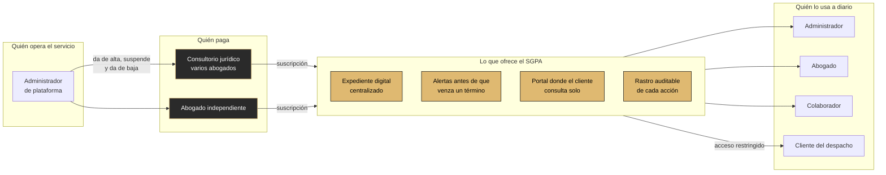

# 01 — Idea de negocio

**Qué responde:** quién usa el sistema, quién lo paga, qué recibe cada uno y por dónde entra el
dinero.

---

## El modelo

---

## Quién es quién

| Actor | Qué obtiene | Qué aporta |
|---|---|---|
| **Consultorio jurídico** | Todos sus abogados trabajando sobre los mismos expedientes, sin carpetas duplicadas | Paga la suscripción |
| **Abogado independiente** | Un sistema que vigila sus plazos sin necesitar personal de apoyo | Paga la suscripción |
| **Abogado** | Deja de depender de su memoria para no perder un término | Registra actuaciones y plazos |
| **Colaborador** | Apoya la gestión sin acceso a lo que no le corresponde | Carga documentos, agenda audiencias |
| **Cliente del despacho** | Consulta el estado de su caso sin llamar por teléfono | Reduce la carga de atención del despacho |
| **Administrador de plataforma** | Gestiona altas, suspensiones y bajas | Opera el servicio |

---

## Por qué un consultorio pagaría por esto

El valor no está en «tener los documentos en la nube». Está en **una consecuencia concreta que
se evita**:

> Un término judicial es **perentorio**. Si se vence, la oportunidad procesal se pierde y no se
> recupera. Eso puede convertirse en una reclamación de responsabilidad profesional contra el
> abogado.

El sistema no calcula términos ni sustituye el criterio jurídico. Lo que hace es **no dejar que
un plazo pase inadvertido**: lo registra, lo vigila y avisa con la antelación que se le indique,
por plataforma y por correo.

Todo lo demás —expediente centralizado, versionado documental, portal del cliente— es
consecuencia de haber tenido que construir un lugar donde vivan esos plazos.

---

## Modelo de ingresos

**Suscripción por consultorio**, con dos planes previstos (`BASICO` y `PRO`).

### Estado real, sin adornos

| Pieza | Estado |
|---|---|
| La plataforma distingue consultorios y los aísla entre sí | ✅ |
| Se puede **suspender** un consultorio y sus usuarios dejan de entrar al instante | ✅ |
| Se puede darlo de baja definitivamente, con tres cerrojos | ✅ |
| Los planes `BASICO` y `PRO` **cambian algo** | 🟥 el campo existe pero no se lee |
| Fechas de vencimiento y de último pago | 🟥 no existen |
| Suspensión automática por impago | 🟥 es manual |
| Pasarela de pago | 🟥 fuera de alcance |

> **Lo construido es la palanca, no la maquinaria.** Hoy se puede cortar el acceso de un
> consultorio moroso en un clic, pero alguien tiene que decidir hacerlo. Conviene decirlo así:
> el aislamiento y la suspensión —que es lo difícil— están resueltos; la automatización del cobro
> está definida y no implementada.

Detalle en [15-ADMINISTRACION-DE-PLATAFORMA.md](../../docs/15-ADMINISTRACION-DE-PLATAFORMA.md).
