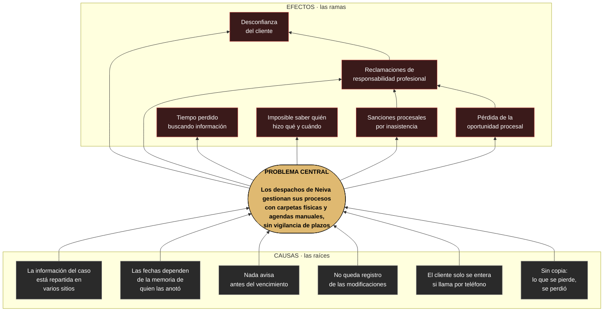

# 02 — Árbol del problema

**Qué responde:** cuál es el problema central, qué lo causa y qué consecuencias produce.

Se lee de abajo arriba: las **raíces** son las causas, el **tronco** el problema y las **ramas**
los efectos.

---

## El árbol



---

## De cada causa a su solución

Aquí está el puente entre el análisis y lo construido. **Cada raíz del árbol tiene una respuesta
concreta en el sistema**, y esa respuesta tiene número de requisito:

| Causa | Cómo la ataca el sistema | Requisitos |
|---|---|---|
| **C1** · Información repartida | Expediente digital único: partes, actuaciones, documentos, audiencias y términos en un solo lugar | RF09–RF17, RF55–RF59 |
| **C2** · Fechas en la memoria | Términos y audiencias registrados con fecha, visibles y consultables | RF27, RF32 |
| **C3** · Nada avisa | Motor de recordatorios cada 15 minutos, con antelación configurable, por plataforma y correo | RF28, RF33, RF37, RF47–RF50 |
| **C4** · Sin registro de cambios | Bitácora inmutable e historial por expediente | RF05, RF14, RNF03 |
| **C5** · El cliente llama | Portal donde consulta solo, con lo que su abogado le habilite | RF43–RF46 |
| **C6** · Sin copia | Documentos en almacenamiento externo con versionado | RF18–RF26 |

> **C6 solo está resuelto a medias, y conviene decirlo.** Los *documentos* sí tienen copia
> externa y versiones. **La base de datos no tiene respaldos automáticos** — expedientes,
> términos y audiencias dependen de un único volumen. Es la carencia declarada en RNF10.3.

---

## Efectos, y por qué se encadenan

Los seis efectos no están al mismo nivel. Tres de ellos **provocan** otros:

```
Sanciones por inasistencia  ─┐
                             ├─→  Reclamación de responsabilidad  →  Desconfianza del cliente
Pérdida de oportunidad      ─┘
```

Esa cadena es la que explica por qué el problema importa más que en otros sectores. Un error de
gestión en un despacho **no lo paga solo el despacho**: lo paga el cliente que confió su asunto,
y el abogado responde por ello.

---

## Lo que el sistema NO resuelve

El árbol también sirve para marcar los límites. Estas causas **existen y quedan fuera**:

| Causa que persiste | Por qué queda fuera |
|---|---|
| El abogado debe saber **qué plazo aplica** a cada actuación | Calcularlo exige interpretar la norma, los días hábiles del juzgado y las suspensiones del proceso. Es criterio jurídico ([ADR-008](../../docs/11-DECISIONES-ARQUITECTONICAS.md)) |
| Los estados de los juzgados hay que consultarlos aparte | No hay integración con los sistemas de la Rama Judicial |
| Alguien tiene que **digitar** la actuación | El sistema no lee notificaciones automáticamente |

> El sistema **vigila** los plazos; no los **deduce**. Esa frontera es deliberada: un plazo mal
> calculado por un programa sería peor que no tener programa.
