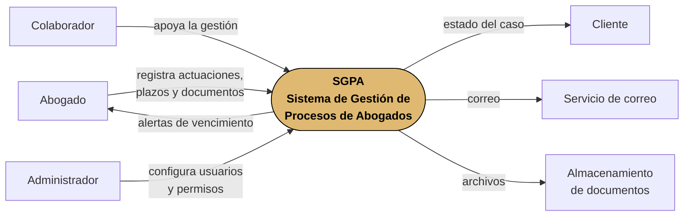
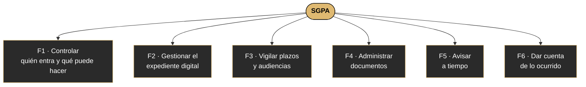
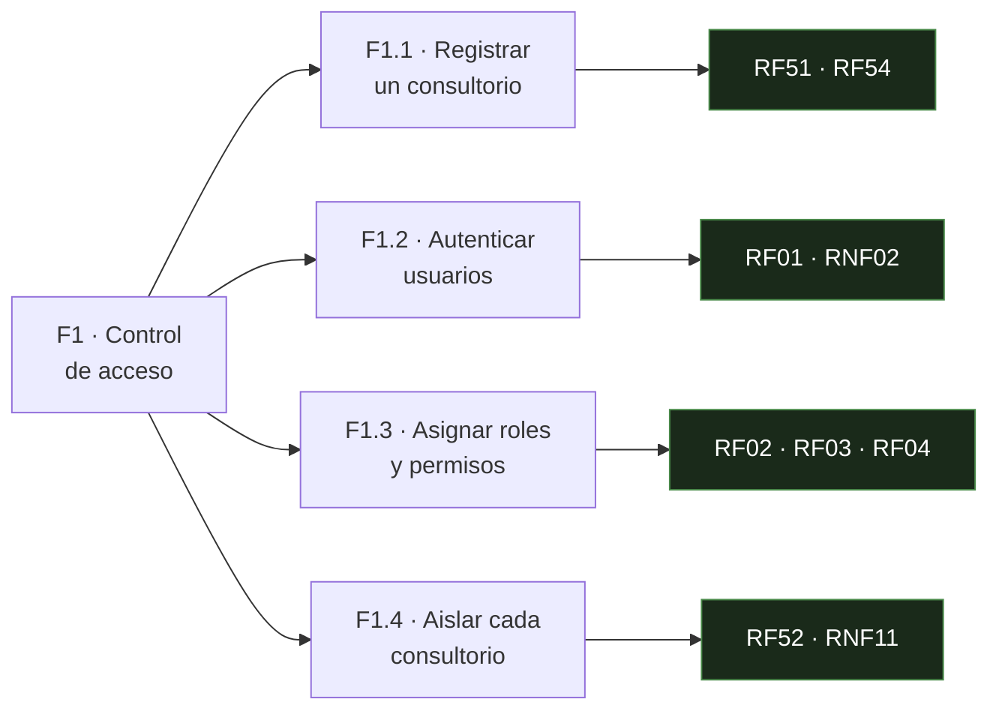
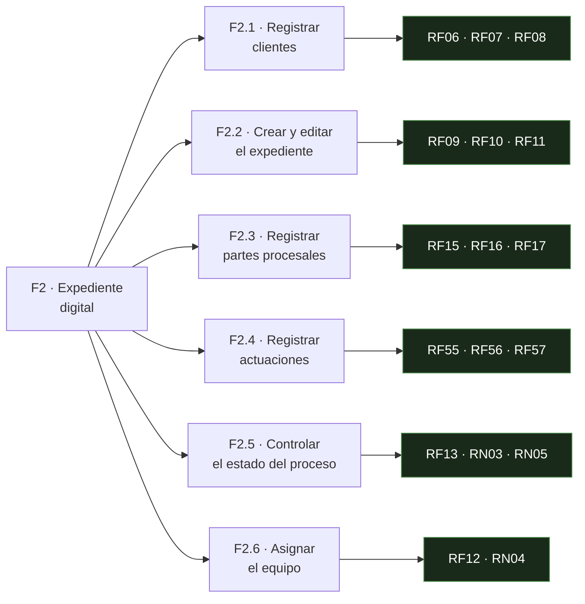
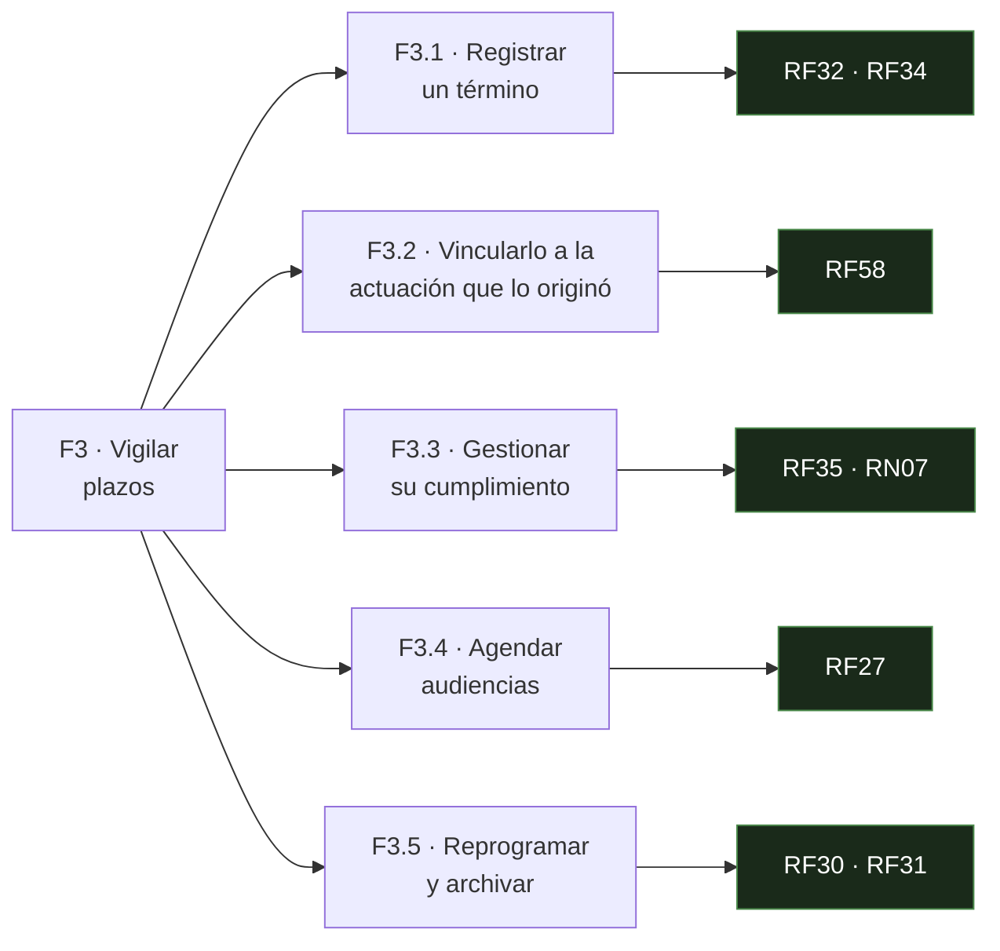
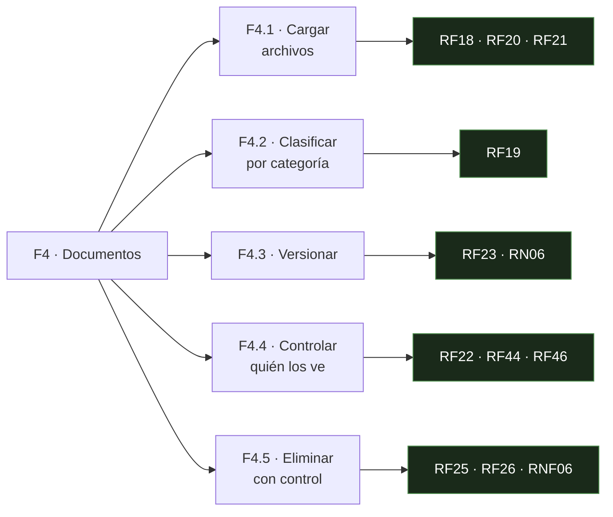
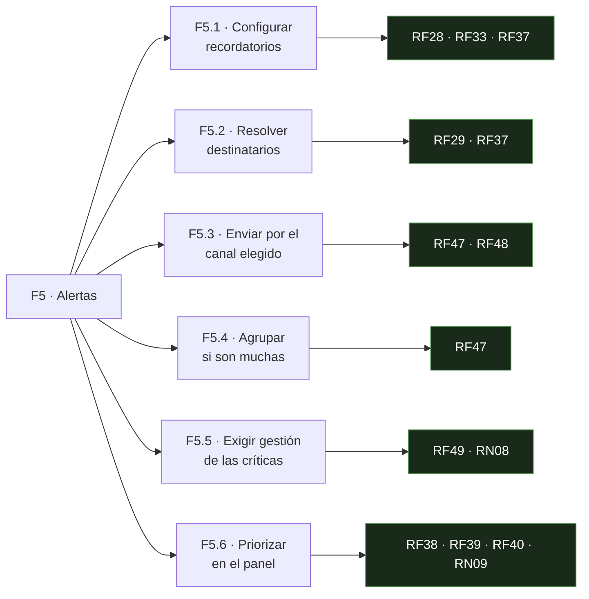
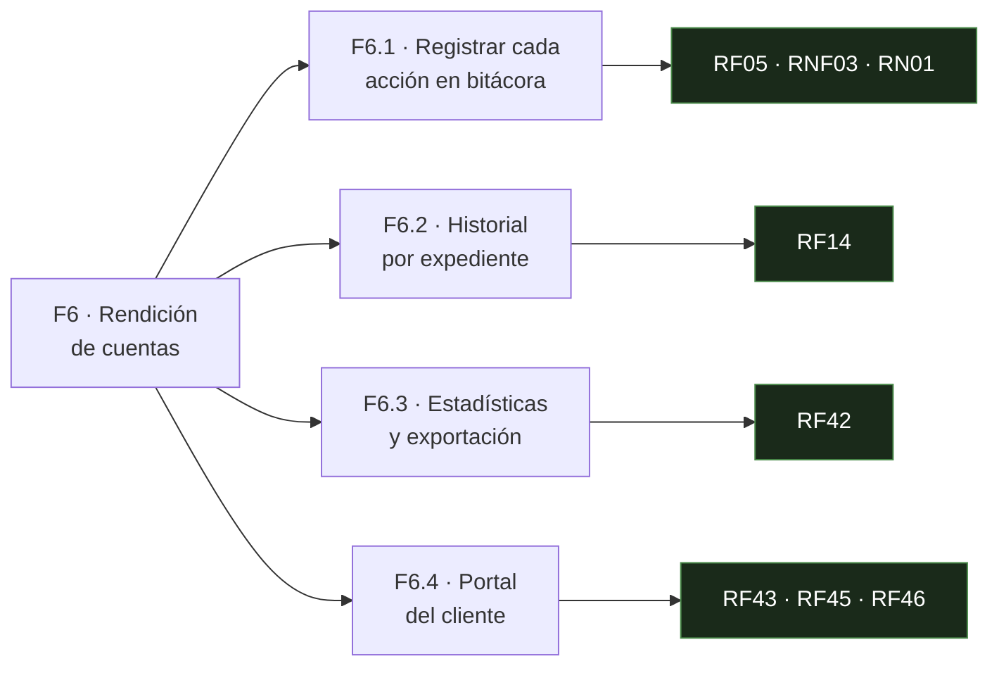

# 03 — Descomposición funcional

**Qué responde:** cómo se pasa del problema a las funciones concretas, bajando nivel a nivel
hasta llegar al requisito que las implementa.

Se lee de arriba abajo. Cada nivel **descompone** el anterior; no añade nada nuevo.

---

## Nivel 0 · El sistema en su contexto

Qué entra, qué sale y con qué se relaciona.

**Qué entra:** actuaciones del juzgado, plazos, documentos, datos de clientes y expedientes.
**Qué sale:** alertas antes del vencimiento, estado del caso para el cliente, rastro auditable.

---

## Nivel 1 · Las seis funciones principales

El problema del despacho, descompuesto en lo que el sistema tiene que **saber hacer**.

| Función | Ataca la causa | Objetivo específico |
|---|---|---|
| **F1** Controlar el acceso | Nadie sabe quién hizo qué | OE-5 |
| **F2** Gestionar el expediente | Información repartida | OE-1 |
| **F3** Vigilar plazos | Fechas en la memoria | OE-2, OE-3 |
| **F4** Administrar documentos | Sin copia ni orden | OE-4 |
| **F5** Avisar a tiempo | **Nada avisa antes del vencimiento** | OE-2 |
| **F6** Dar cuenta | Sin registro de cambios | OE-6, OE-7 |

> **F5 es el corazón del sistema.** Las otras cinco existen para que F5 sea posible: no se puede
> avisar de un plazo que no está registrado, en un expediente que no existe, a un usuario que no
> tiene sesión.

---

## Nivel 2 · Desglose hasta el requisito

Cada función abierta en las capacidades concretas que la componen, con el número de requisito que
la implementa.

### F1 · Controlar quién entra y qué puede hacer

### F2 · Gestionar el expediente digital

### F3 · Vigilar plazos y audiencias

### F4 · Administrar documentos

### F5 · Avisar a tiempo

### F6 · Dar cuenta de lo ocurrido

---

## La cadena completa, de un vistazo

Este es el recorrido que el diagrama permite responder sin abrir otro documento:

| | |
|---|---|
| **Problema** | Los plazos se vencen porque nada avisa |
| ↓ **Función (N1)** | F5 · Avisar a tiempo |
| ↓ **Capacidad (N2)** | F5.1 · Configurar recordatorios |
| ↓ **Requisito** | RF33 — Valores por defecto: 5 días, 1 día y el día del vencimiento |
| ↓ **Historia** | HU-22 · Recordatorios de término |
| ↓ **Código** | `terminos.controller.js` · `recordatorios.job.js` |
| ↓ **Prueba** | `terminos_audiencias.test.js` |

**Seis niveles, del problema al archivo.** Es la cadena que sostiene todo el sistema documental:
si en cualquier eslabón no hubiera respuesta, el requisito estaría de adorno.

---

## Cobertura

Se cuentan los **requisitos que este mismo diagrama asocia a cada función** —los RF y RNF de las
cajas verdes de arriba—, con el estado que declaran los documentos 03 y 04. Las reglas de negocio
tienen su propio cuadro en el [documento 02](../documentos/02-REGLAS-DE-NEGOCIO.md). Contarlo así
lo hace reproducible: sale del diagrama, no de una lista aparte que pueda desviarse.

| Función | Requisitos | Cumplidos | Qué queda |
|---|---:|---:|---|
| F1 · Control de acceso | 9 | 7 | RF52 y RNF11 *(aislamiento por base de datos)* |
| F2 · Expediente digital | 14 | 14 | — |
| F3 · Plazos y audiencias | 7 | 7 | — |
| F4 · Documentos | 11 | 11 | — |
| F5 · Alertas | 10 | 10 | — |
| F6 · Rendición de cuentas | 7 | 6 | RNF03 *(retención a cinco años)* |

> **F6 fue durante mucho tiempo la menos completa**, y era coherente con lo que declaraban los
> requisitos: faltaban exportar la bitácora, exportar reportes en PDF y registrar el inicio de
> sesión. Las tres no conformidades de la verificación automática caían justo ahí, lo cual dice
> algo sobre la naturaleza del hueco: **el sistema hacía bien su trabajo, pero no sabía
> contarlo.** Rendición de cuentas es la función que no se nota mientras nadie pregunta, y por eso
> fue la última en completarse. Los tres puntos se cerraron el 3 de septiembre de 2026; solo sigue
> abierto **RNF03.5**, la retención a cinco años, que depende de tener copias de seguridad
> automáticas y no de escribir código.
>
> **La menos completa es ahora F1 · Control de acceso, 7 de 9**, y sus dos pendientes son en
> realidad **una sola decisión**: RF52 y RNF11 piden lo mismo desde dos sitios, que el aislamiento
> entre consultorios lo sostenga además la base de datos y no solo el código. Se evaluó y se
> pospuso en [ADR-003](../../docs/11-DECISIONES-ARQUITECTONICAS.md).
>
> El tercer pendiente que tenía esta función, el limitador de peticiones en `/api/auth/login`
> (RNF02.8), se cerró el 3 de septiembre de 2026.
>
> **Esta tabla decía otra cosa hasta el 3 de septiembre de 2026**, y merece anotarse porque el
> error era de los que no se ven. Daba F5 como la más incompleta, 6 de 8, «por el umbral de
> inactividad fijo en 30 días en vez de configurable». Ese umbral **no era una brecha**: RF40 fija
> los 30 días de forma literal, así que hacerlo configurable sería una mejora y nunca fue un
> criterio. La tabla llevaba contabilizada como incumplimiento una exigencia que ningún requisito
> hace.
