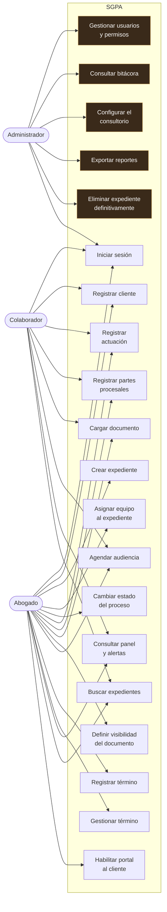
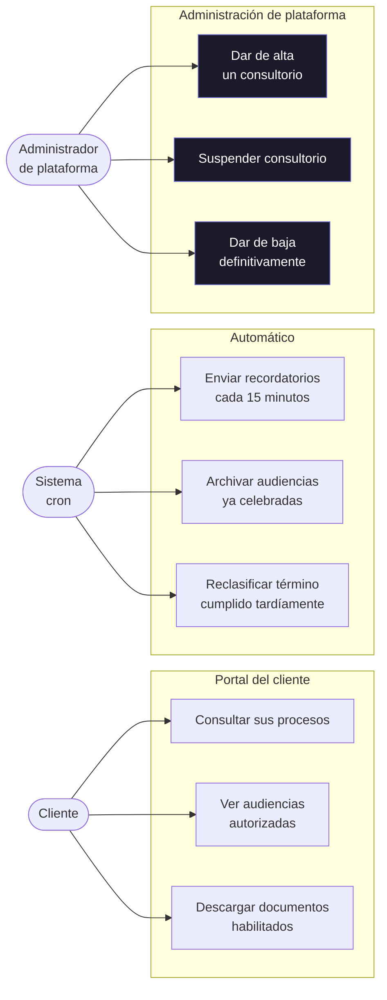
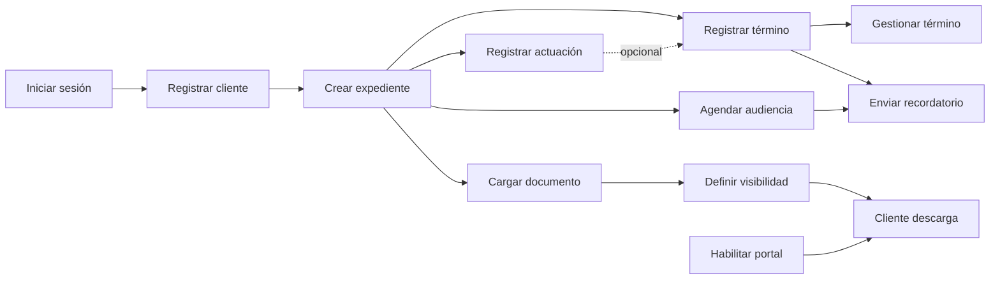

# 04 — Casos de uso

**Qué responde:** qué puede hacer cada actor y qué casos comparten entre sí.

---

## Actores

| Actor | Quién es |
|---|---|
| **Administrador** | Titular del consultorio o abogado independiente |
| **Abogado** | Profesional que lleva casos |
| **Colaborador** | Personal de apoyo, con permisos limitados |
| **Cliente** | Persona o empresa representada |
| **Sistema** | Actor no humano: el cron que dispara las alertas |
| **Administrador de plataforma** | Opera el servicio. **Fuera del consultorio** |

---

## Casos de uso del despacho

Los casos resaltados son **exclusivos del Administrador**.

---

## Casos de uso del cliente y del sistema

> **Los tres casos en azul están fuera del sistema del consultorio.** El administrador de
> plataforma no aparece en el primer diagrama porque **no puede ejecutar ninguno de aquellos
> casos**: su token es de otro tipo y el middleware de consultorios lo rechaza. No es una
> restricción de pantalla, es de sesión ([ADR-012](../../docs/11-DECISIONES-ARQUITECTONICAS.md)).

---

## Casos que dependen de otros

Algunos casos de uso **no se pueden ejecutar aislados**. Esto es lo mismo que el grafo de
dependencias entre historias, visto desde el actor:

**Se lee así:** para que un cliente pueda descargar un documento (CU23) hacen falta antes cuatro
cosas: iniciar sesión, crear el expediente, cargar el documento, marcarlo como compartido y
habilitarle el portal.

---

## Detalle de los tres casos con más reglas

### CU08 · Cambiar el estado del proceso

| | |
|---|---|
| **Actor** | Abogado, Administrador |
| **Precondición** | El expediente existe y el actor tiene permiso de edición |
| **Flujo principal** | 1. Elige el estado nuevo · 2. Escribe la justificación · 3. Confirma · 4. El sistema valida y registra en el historial |
| **Flujo alterno A** | Si archiva y hay términos pendientes o audiencias en 30 días → el sistema **enumera qué lo impide** y no procede (RN05) |
| **Flujo alterno B** | Si es Administrador, puede repetir con confirmación explícita y forzarlo |
| **Flujo alterno C** | Si el proceso está cerrado y quiere reactivarlo sin ser Administrador → 403 (RN03) |
| **Postcondición** | Estado cambiado, justificación en el historial, acción en la bitácora |

### CU15 · Gestionar un término judicial

| | |
|---|---|
| **Actor** | Abogado |
| **Precondición** | El término existe y está pendiente |
| **Flujo principal** | 1. Elige cumplido, cumplido tardío o incumplido · 2. Escribe la justificación · 3. Confirma |
| **Flujo alterno** | Si marca **cumplido** y la fecha de vencimiento ya pasó → el sistema lo reclasifica **solo** como *cumplido tardío* (RN07) |
| **Excepción** | Sin justificación → 400 |
| **Postcondición** | Estado registrado, alertas asociadas cerradas |

> El flujo alterno de CU15 es la regla con más peso jurídico del sistema: un término es
> **perentorio**, y cumplirlo tarde no es cumplirlo.

### CU19 · Eliminar un expediente definitivamente

| | |
|---|---|
| **Actor** | Administrador **únicamente** |
| **Precondición** | Sin documentos activos ni términos pendientes |
| **Flujo principal** | 1. Escribe la justificación · 2. Confirma en dos pasos · 3. El sistema borra en cascada dentro de una transacción |
| **Excepción A** | Si el actor no es Administrador → 403 |
| **Excepción B** | Si hay pendientes → 400 con el recuento |
| **Postcondición** | Expediente y todo lo asociado eliminados; la acción queda en la bitácora, **que sobrevive** |
