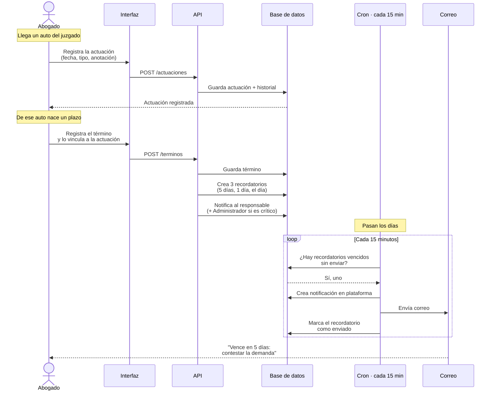
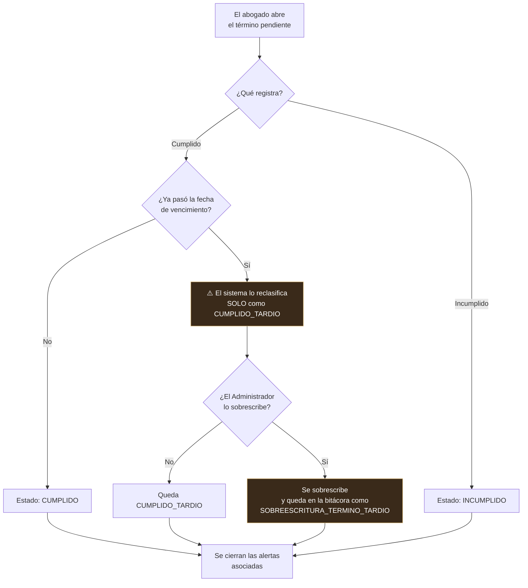
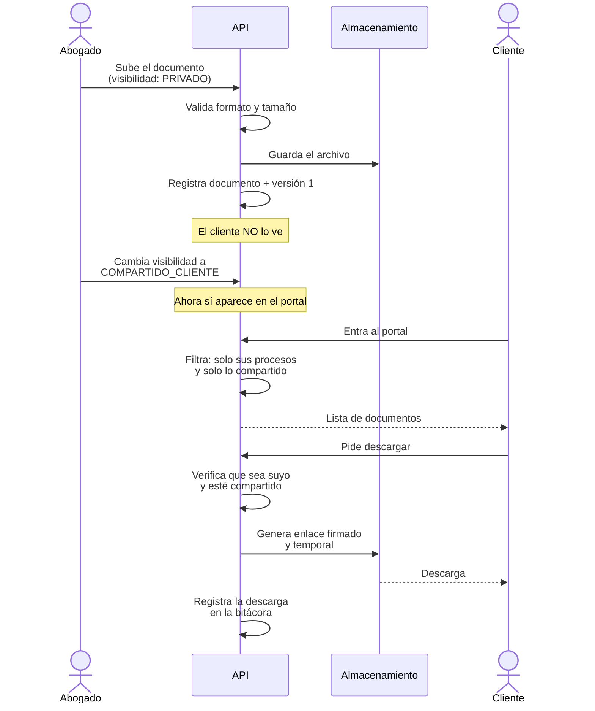
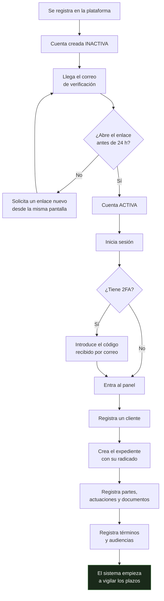
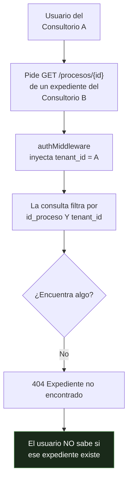

# 05 — Flujos principales

**Qué responde:** el recorrido completo de las cuatro operaciones que definen el sistema, paso a
paso y con lo que ocurre por debajo.

---

## 1. Del auto del juzgado a la alerta

**Es el flujo que resuelve el problema original.** Del juzgado sale un auto, del auto nace un
plazo, y del plazo debe salir un aviso antes de que se venza.

**Por qué importa el vínculo actuación → término.** Sin él, un plazo aparece suelto y nadie
recuerda de dónde salió. Con él, se puede responder a *«¿por qué existe este término?»*
señalando el auto que lo originó.

---

## 2. Gestionar el término, y la regla que lo gobierna

> **La reclasificación no se puede evitar desde la interfaz.** Ocurre en el servidor, antes de
> guardar. Un término perentorio cumplido fuera de plazo **no es un término cumplido**, y
> registrarlo como tal falsearía el historial del caso. Es la regla RN07.

---

## 3. De un documento privado a la descarga del cliente

**Tres controles antes de cada descarga:** que el documento pertenezca a un proceso del cliente,
que esté marcado como compartido, y que el enlace sea temporal. Y la descarga queda auditada.

---

## 4. Del registro al primer expediente

El recorrido de un consultorio nuevo, de principio a fin.

> El paso **E** —solicitar otro enlace— no existía hasta el 2 de septiembre de 2026. Sin él, un
> correo perdido en la carpeta de spam dejaba a esa persona **bloqueada sin salida**: no podía
> activar la cuenta, no podía pedir otro mensaje y no podía volver a registrarse porque el correo
> ya figuraba como usado.

---

## 5. Qué ocurre cuando alguien intenta ver lo que no es suyo

**Se responde 404, no 403, y es deliberado.** Un 403 diría «existe, pero no puedes verlo», lo
que confirma la existencia de un expediente ajeno. El 404 no revela nada.

> El requisito RNF11 pide explícitamente un 403. **Se decidió no cumplirlo**, y la razón está
> escrita en el catálogo: cumplir la letra de ese requisito empeoraría la seguridad. Es un
> desacuerdo argumentado con la especificación, no un olvido.
