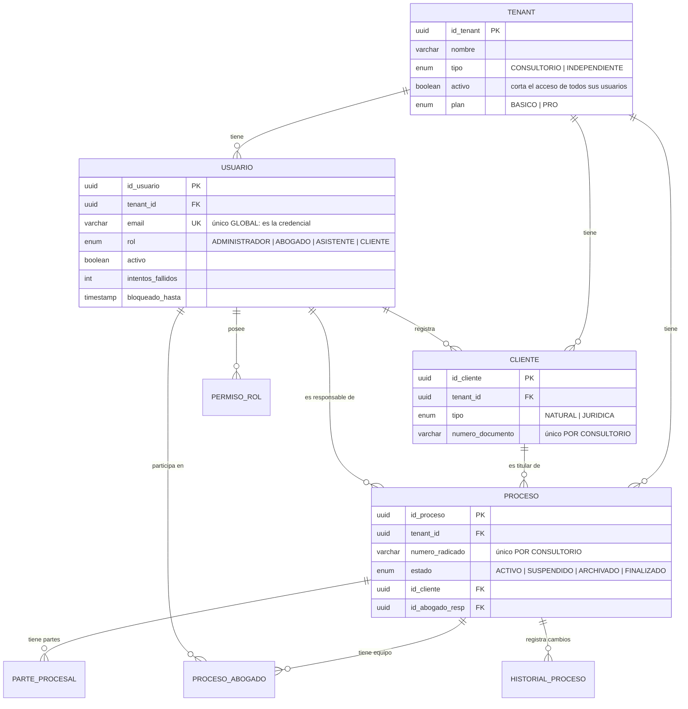
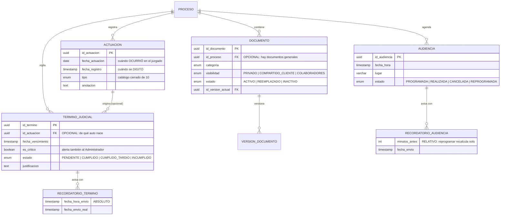
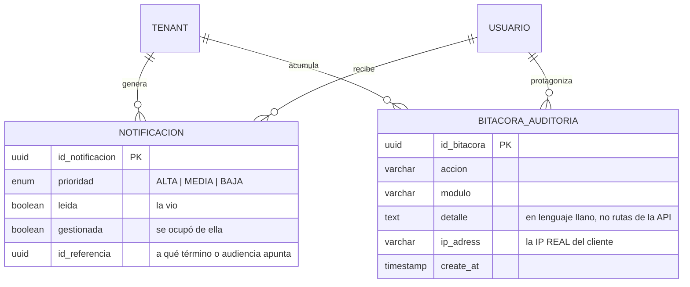
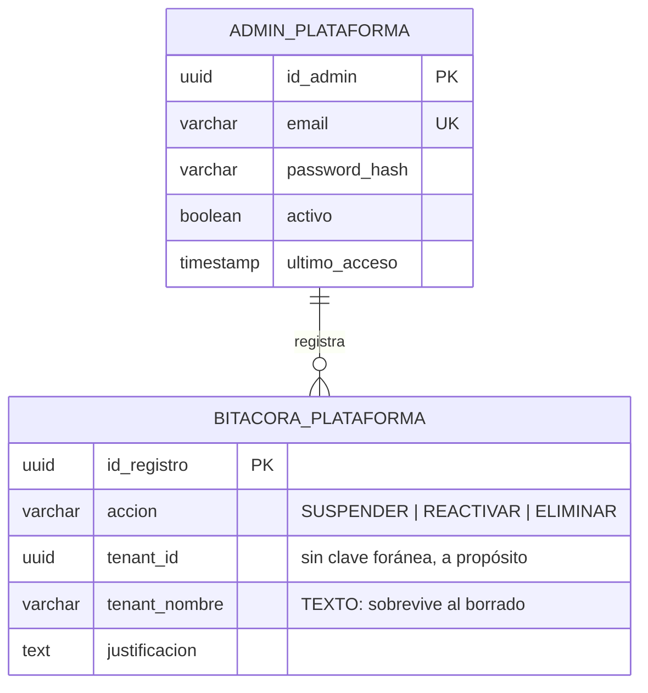

# 06 — Entidad–relación

**Qué responde:** cómo se guardan los datos y cómo se relacionan las entidades entre sí.

Derivado de `backend/prisma/schema.prisma`, no de un diseño previo. **19 entidades.**

---

## Núcleo: el consultorio y el expediente



---

## El contenido del expediente



**Dos detalles que se preguntan:**

Las **dos claves foráneas opcionales** no son descuidos. `TERMINO.id_actuacion` es opcional
porque un plazo puede registrarse suelto (RF32); `DOCUMENTO.id_proceso` lo es porque existen
documentos generales del despacho (RF21).

Los **dos tipos de recordatorio se modelan distinto**. El de audiencia guarda *minutos antes*,
así que reprogramar recalcula los avisos solo. El de término guarda la *fecha y hora exacta* de
envío, porque un plazo no se mueve.

---

## Alertas y rastro



> **`leida` y `gestionada` son campos distintos a propósito.** Ver una alerta no es haberse
> ocupado de ella. Una alerta crítica permanece hasta que alguien la marca como gestionada, y
> solo puede hacerlo su destinatario (RN08).

---

## Administración de la plataforma — aislada del resto



**Estas dos entidades no tienen ninguna relación con `TENANT`.** No es un olvido del diagrama:

- `ADMIN_PLATAFORMA` **no tiene `tenant_id`** porque no pertenece a ningún consultorio.
- `BITACORA_PLATAFORMA` guarda el nombre del consultorio como **texto y no como clave foránea**,
  porque tiene que seguir teniendo sentido cuando el consultorio ya no exista. Si fuera una
  relación, el registro de «quién eliminó este consultorio» desaparecería junto con él.

---

## La asimetría de las claves únicas

| Campo | Alcance | Por qué |
|---|---|---|
| `USUARIO.email` | **Global** | Es la credencial y el login no tiene selector de consultorio. Si se repitiera, el sistema no sabría a quién autenticar |
| `CLIENTE.numero_documento` | **Por consultorio** | Una persona puede ser cliente de dos despachos |
| `PROCESO.numero_radicado` | **Por consultorio** | **La contraparte litiga el mismo proceso con el mismo radicado** desde otro despacho |

Los dos últimos eran globales hasta el 2 de septiembre de 2026. Además de impedir usos
legítimos, el mensaje *«ese radicado ya existe en el sistema»* revelaba que otro consultorio
llevaba ese caso.

---

## Integridad referencial

**Ninguna clave foránea borra en cascada.** Todas son `ON DELETE RESTRICT`.

Es deliberado: en un sistema jurídico, un borrado que arrastra registros en silencio es
peligroso. Eliminar un expediente se hace explícitamente, dentro de una transacción y en orden,
de las hojas hacia la raíz:

```
recordatorios → versiones → notificaciones → historial → bitácora
   → partes → términos → actuaciones → audiencias → documentos
      → proceso
```

> Esa decisión tuvo un coste real: al añadir `ACTUACION` se olvidó incluirla en la transacción, y
> eliminar un expediente con actuaciones empezó a fallar con un error opaco. Hoy hay una prueba
> que vigila que la cascada las contemple.
