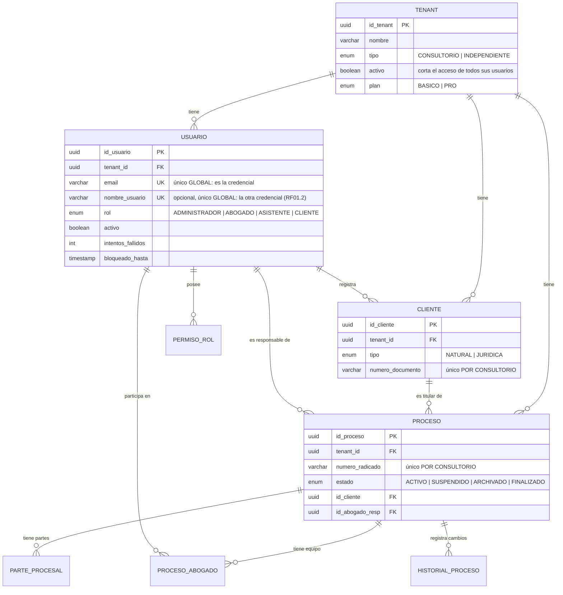
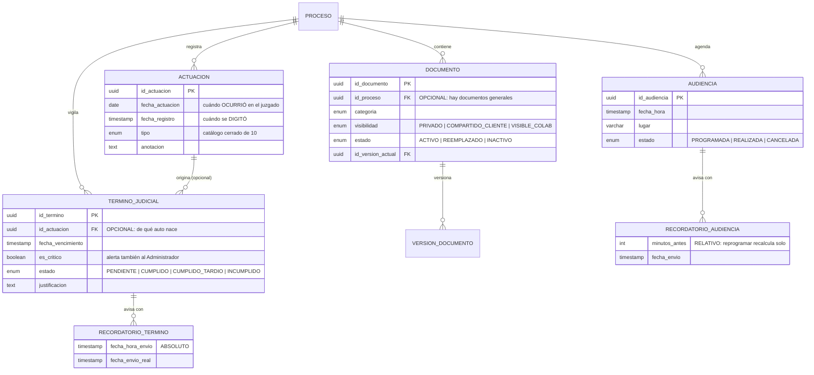
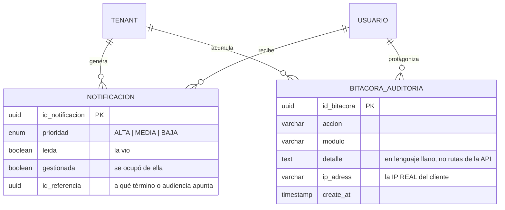
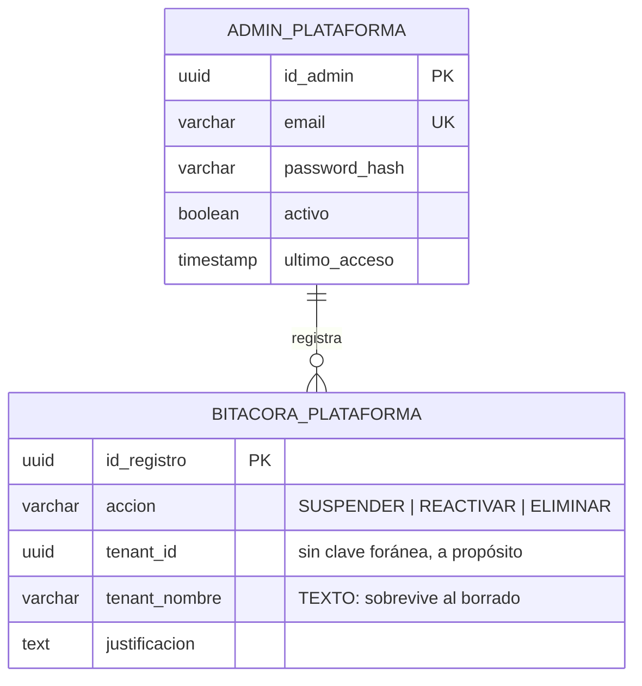
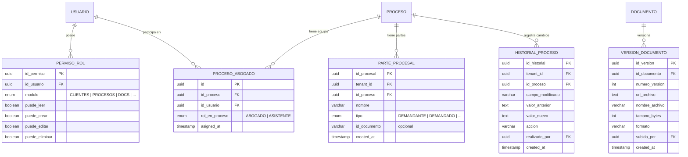

# 06 — Entidad–relación

**Qué responde:** cómo se guardan los datos y cómo se relacionan las entidades entre sí.

Derivado de `backend/prisma/schema.prisma`, no de un diseño previo. **19 entidades.**

---

## Núcleo: el consultorio y el expediente



---

## El contenido del expediente



**Tres detalles que se preguntan:**

Las **dos claves foráneas opcionales** no son descuidos. `TERMINO.id_actuacion` es opcional
porque un plazo puede registrarse suelto (RF32); `DOCUMENTO.id_proceso` lo es porque existen
documentos generales del despacho (RF21).

Los **dos tipos de recordatorio se modelan distinto**. El de audiencia guarda *minutos antes*,
así que reprogramar recalcula los avisos solo. El de término guarda la *fecha y hora exacta* de
envío, porque un plazo no se mueve.

**«Reprogramada» no es un estado**, aunque RF30 exija poder reprogramar. Una audiencia movida
sigue estando `PROGRAMADA`: lo que cambia es su fecha. El hecho de que se movió queda en
`HISTORIAL_PROCESO` como `AUDIENCIA_REPROGRAMADA`, con la fecha anterior y la nueva. Es la
distinción entre **en qué situación está** algo y **qué le pasó**: un estado que dijera
«reprogramada» no sabría responder si la audiencia ya se celebró.

---

## Alertas y rastro



> **`leida` y `gestionada` son campos distintos a propósito.** Ver una alerta no es haberse
> ocupado de ella. Una alerta crítica permanece hasta que alguien la marca como gestionada, y
> solo puede hacerlo su destinatario (RN08).

---

## Administración de la plataforma — aislada del resto



**Estas dos entidades no tienen ninguna relación con `TENANT`.** No es un olvido del diagrama:

- `ADMIN_PLATAFORMA` **no tiene `tenant_id`** porque no pertenece a ningún consultorio.
- `BITACORA_PLATAFORMA` guarda el nombre del consultorio como **texto y no como clave foránea**,
  porque tiene que seguir teniendo sentido cuando el consultorio ya no exista. Si fuera una
  relación, el registro de «quién eliminó este consultorio» desaparecería junto con él.

---

## Las cinco tablas de apoyo

Aparecen en las relaciones de los diagramas anteriores, pero se detallan aquí para no cargar
el núcleo. Ninguna es una entidad del negocio por sí sola: **tres resuelven relaciones de muchos
a muchos o de uno a muchos, y dos guardan historia.**



**Tres detalles que se preguntan:**

`PERMISO_ROL` **cuelga del usuario, no del rol.** El rol da el punto de partida; el Administrador
puede afinar los permisos de una persona concreta sin tocar a los demás de su mismo rol (RF03).

`PROCESO_ABOGADO` es la razón de que un expediente pueda tener **varios abogados**.
`PROCESO.id_abogado_resp` señala al responsable —el que responde ante el cliente—, y esta tabla
recoge al resto del equipo. Sin ella, `RN04` no tendría dónde apoyarse.

`VERSION_DOCUMENTO` guarda la URL de **cada versión**, no solo de la última. Es lo que permite
recuperar una redacción anterior de una demanda, que es justamente cuando importa.

---

## La asimetría de las claves únicas

| Campo | Alcance | Por qué |
|---|---|---|
| `USUARIO.email` | **Global** | Es la credencial y el login no tiene selector de consultorio. Si se repitiera, el sistema no sabría a quién autenticar |
| `USUARIO.nombre_usuario` | **Global** | Por lo mismo, y con más motivo: es la credencial alternativa. Es opcional —nulo significa «esta cuenta solo entra por correo»— y no puede contener arroba, que es lo que permite al login distinguirlo del correo |
| `CLIENTE.numero_documento` | **Por consultorio** | Una persona puede ser cliente de dos despachos |
| `PROCESO.numero_radicado` | **Por consultorio** | **La contraparte litiga el mismo proceso con el mismo radicado** desde otro despacho |

Los dos últimos eran globales hasta el 2 de septiembre de 2026. Además de impedir usos
legítimos, el mensaje *«ese radicado ya existe en el sistema»* revelaba que otro consultorio
llevaba ese caso.

---

## Integridad referencial

**Ninguna clave foránea borra en cascada.** El esquema no declara ningún `onDelete`, así que
rige el comportamiento por defecto, que depende de si la relación es obligatoria:

| Relación | Acción al borrar el padre | Cuántas |
|---|---|---:|
| Obligatoria | `RESTRICT` — el borrado falla si hay hijos | 17 |
| Opcional | `SET NULL` — el hijo sobrevive con el campo vacío | 2 |

Las dos opcionales son `DOCUMENTO.id_proceso` y `TERMINO_JUDICIAL.id_actuacion`, y no es
casualidad que sean justo las dos que el negocio permite dejar sueltas: un documento general del
despacho (RF21) y un plazo registrado a mano (RF32). En ambas, `SET NULL` deja exactamente el
estado que el requisito ya contempla.

Que nada se borre en cascada es deliberado: en un sistema jurídico, un borrado que arrastra
registros en silencio es peligroso. Eliminar un expediente se hace explícitamente, dentro de una
transacción y en orden, de las hojas hacia la raíz:

```
equipo → partes
  → recordatorios de audiencia → audiencias
  → recordatorios de término   → términos
  → versiones                  → documentos
  → historial → actuaciones
    → proceso
```

**La bitácora y las notificaciones no aparecen en esa lista, y es lo importante.** No se borran:
la bitácora es inmutable por RN01 —si desapareciera con el expediente, la auditoría no serviría
para nada— y las notificaciones no cuelgan del proceso.

**Las actuaciones van después de los términos.** Un término apunta a la actuación de la que
nace; aunque esa clave sea `SET NULL`, borrar primero los términos evita dejar filas a medias.
Y la clave de actuación hacia proceso sí es `RESTRICT`, así que sin esa línea el borrado falla.

> Esa decisión tuvo un coste real: al añadir `ACTUACION` se olvidó incluirla en la transacción, y
> eliminar un expediente con actuaciones empezó a fallar con un error opaco. Hoy hay una prueba
> que vigila que la cascada las contemple.
