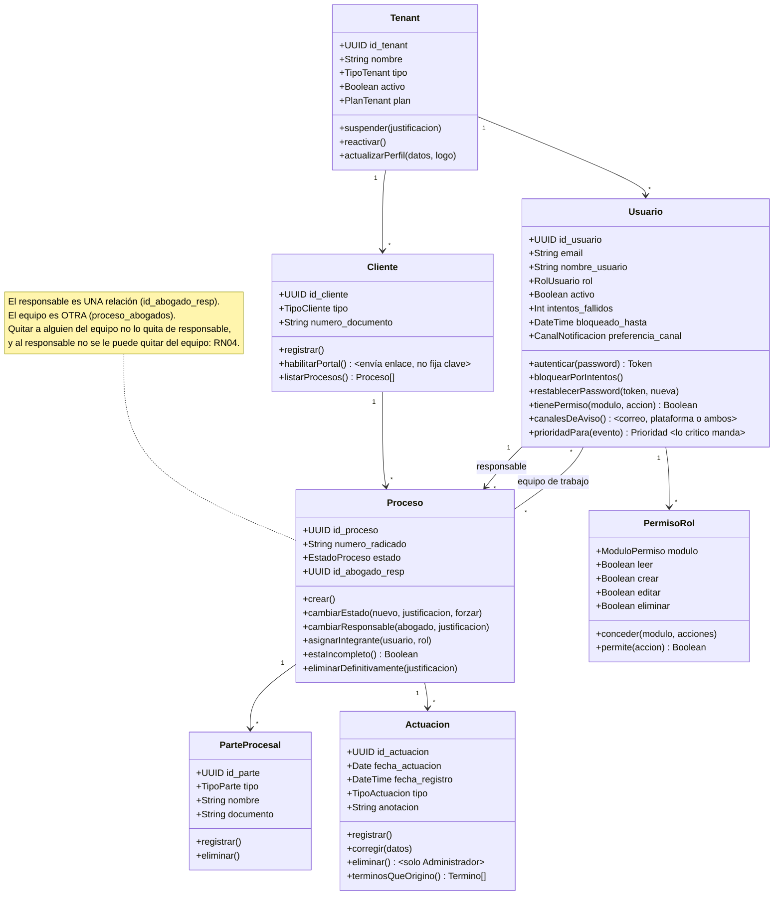
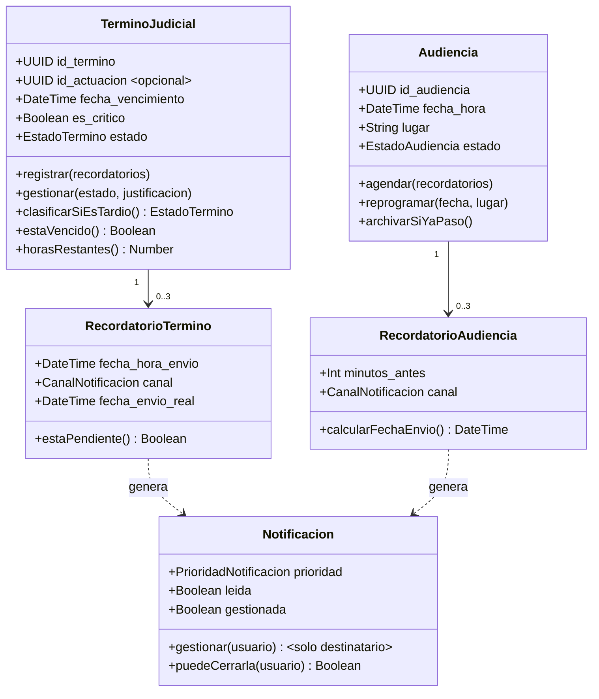
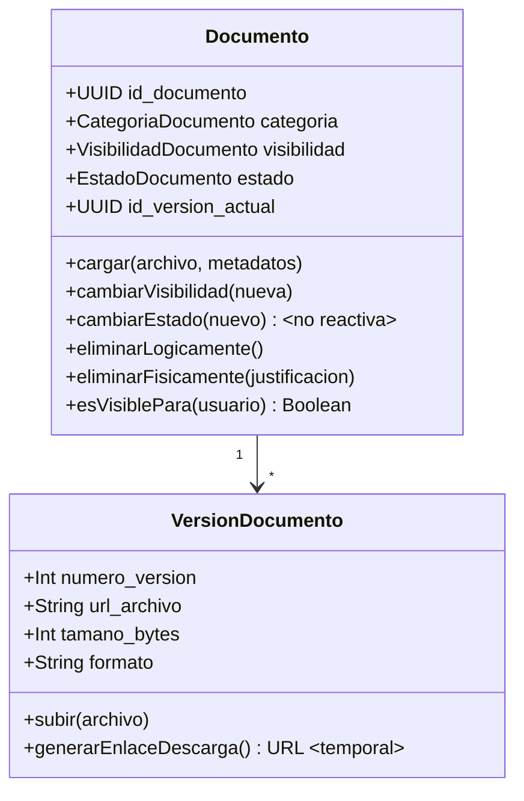
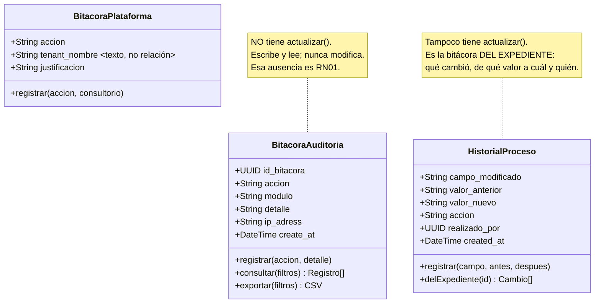
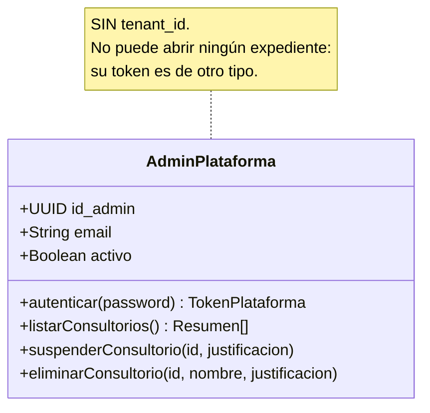

# 07 — Diagrama de clases

**Qué responde:** las entidades del dominio con sus atributos y **su comportamiento** — lo que
cada una sabe hacer.

> **Diferencia con el diagrama entidad–relación.** Aquel muestra cómo se *almacenan* los datos;
> este muestra qué *operaciones* existen sobre ellos. El sistema no usa clases al estilo de Java:
> son módulos con funciones. El diagrama representa la organización lógica, y cada método se
> corresponde con una función real del controlador.

---

## Dominio del expediente

> **La relación «equipo de trabajo» es de muchos a muchos y en la base de datos tiene tabla
> propia,** `proceso_abogados`, con el rol de cada integrante. No aparece aquí como clase a
> propósito: no tiene comportamiento —ninguna función opera sobre ella salvo crearla y
> borrarla—, y este diagrama muestra *qué sabe hacer cada entidad*. Se representa como lo que
> es: una asociación.

**Métodos que encierran una regla de negocio:**

| Método | Regla |
|---|---|
| `Proceso.cambiarEstado()` | No archiva con pendientes (RN05); no reabre sin Administrador (RN03) |
| `Proceso.cambiarResponsable()` | El entrante debe ser del consultorio, estar activo y ser Abogado o Administrador (RN04). Exige justificación |
| `Cliente.habilitarPortal()` | **No recibe contraseña.** Crea la cuenta sin credencial utilizable y envía al cliente un enlace para que elija la suya (RN02.3) |
| `Actuacion.eliminar()` | Solo Administrador, y bloqueado si tiene términos (RF59) |
| `Tenant.suspender()` | Corta el acceso de **todos** sus usuarios de golpe |
| `Usuario.bloquearPorIntentos()` | Bloqueo escalado: 1, 5, 15, 30 y 60 minutos |
| `PermisoRol.permite()` | Es lo que `roles.middleware.js` consulta antes de cada operación (RF03) |
| `Usuario.canalesDeAviso()` | RF47.1 — decide si el aviso sale por correo, por la plataforma o por los dos. Ante una preferencia ausente o corrupta avisa por ambos: en un sistema de plazos, equivocarse avisando de más es recuperable; callando, no |
| `Usuario.prioridadPara()` | RF48.2 — **la criticidad manda sobre la preferencia**. Un término crítico es ALTA aunque su destinatario prefiera baja, porque bajarla sería silenciarla |

---

## Plazos y avisos

**Los dos métodos más importantes del sistema:**

`TerminoJudicial.clasificarSiEsTardio()` — Se ejecuta **en el servidor**, antes de guardar, y no
se puede evitar desde la interfaz. Si se marca *cumplido* después del vencimiento, devuelve
`CUMPLIDO_TARDIO`. Es RN07, la regla con más peso jurídico del sistema.

`Notificacion.puedeCerrarla(usuario)` — Devuelve verdadero solo si el usuario es el destinatario,
o es Administrador **y** el destinatario está inactivo. Es RN08: cerrar una alerta es afirmar
«me he ocupado de esto», y nadie puede afirmarlo por otro.

---

## Documentos

`Documento.cambiarEstado()` rechaza cualquier transición hacia activo desde *reemplazado* o
*inactivo* (RN06). `esVisiblePara()` es el filtro que impide que una nota interna llegue al
portal del cliente (RF46).

---

## Auditoría — el patrón que la hace fiable

> **Estos dos métodos existen porque durante un tiempo no existieron.** Los campos de
> preferencia estaban en la base y la pantalla los guardaba, pero **nadie los leía al avisar**:
> el envío era siempre por correo y la prioridad estaba escrita a mano en el código. Se
> corrigió el 4 de septiembre de 2026. Aparecen aquí porque un diagrama de clases que muestra
> los atributos sin el comportamiento que los usa deja creer que el dato sirve para algo por
> el mero hecho de estar guardado.
>
> **Hay tres registros y no uno, y responden a preguntas distintas.**
> `BitacoraAuditoria` responde *«¿quién hizo qué en el consultorio?»* y abarca todos los módulos.
> `HistorialProceso` responde *«¿qué le ha pasado a ESTE expediente?»* y por eso guarda el valor
> anterior y el nuevo, que es lo que permite leer un cambio de estado o un relevo de responsable
> sin reconstruirlo. `BitacoraPlataforma` responde *«¿qué se hizo con los consultorios?»* y vive
> aparte porque tiene que sobrevivir a la baja del consultorio del que habla.
>
> **La ausencia de métodos es aquí tan significativa como su presencia.** `BitacoraAuditoria`
> registra, se consulta y se exporta, pero **no se modifica**: no existe ningún `update` sobre
> ella en todo el backend. Esa ausencia **es** la implementación de RN01, porque una bitácora que
> su administrador puede alterar no sirve como prueba de nada.

> **Un borrado sí existe, y conviene saberlo antes de que lo pregunten.** Cuando el
> administrador de la plataforma da de baja un consultorio entero, la bitácora de ese
> consultorio desaparece con él —las claves foráneas son `RESTRICT`, así que no podría ser de
> otra forma—. No permite quitar una línea suelta, y el acto queda anotado en
> `BitacoraPlataforma`. Por eso esa clase guarda `tenant_nombre` como **texto y no como
> relación**: tiene que seguir teniendo sentido cuando el consultorio ya no exista.

---

## Identidad separada de la plataforma

**Ningún método de esta clase devuelve contenido de un expediente.** `listarConsultorios()`
devuelve nombre, contacto, plan, estado y **recuentos** — cuántos usuarios, cuántos clientes,
cuántos expedientes. Nunca sus datos.

No es una limitación de la interfaz: el token de esta identidad es de tipo `PLATAFORMA` y el
middleware de los consultorios lo rechaza con 403. La separación es de sesión, no de pantalla
([ADR-012](../../docs/11-DECISIONES-ARQUITECTONICAS.md)).
