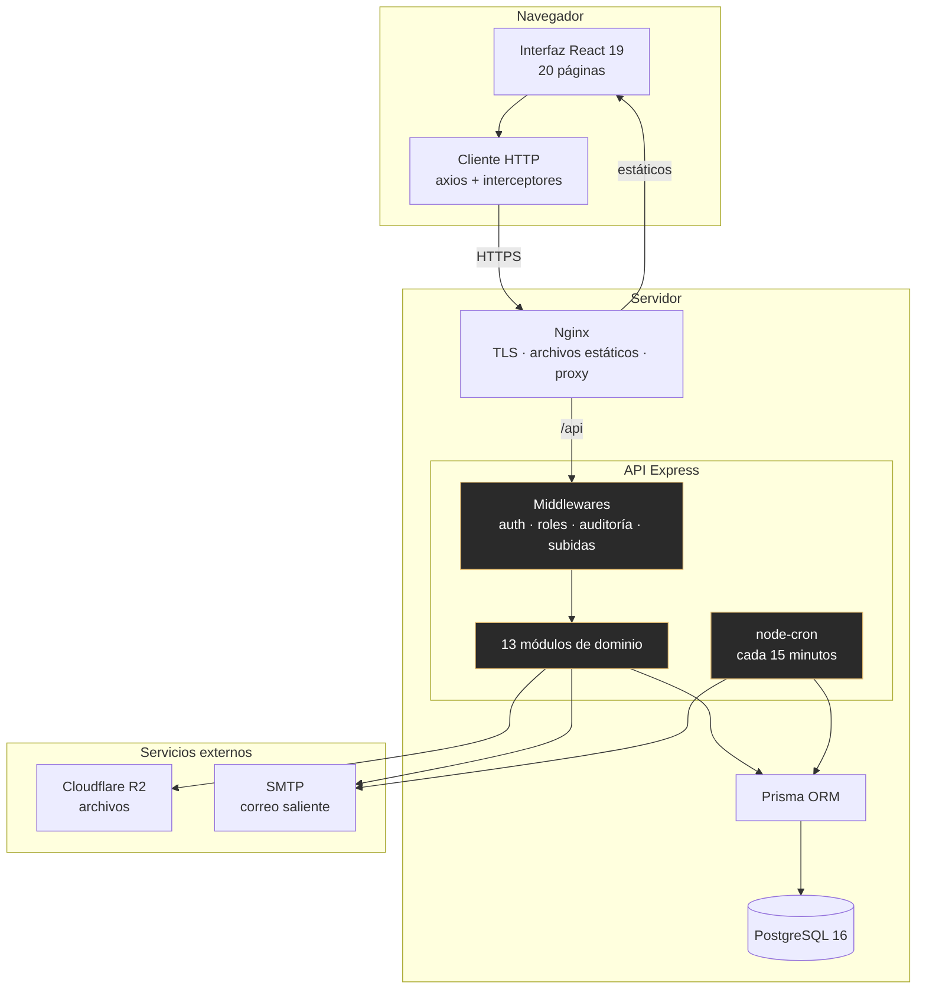
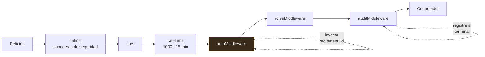
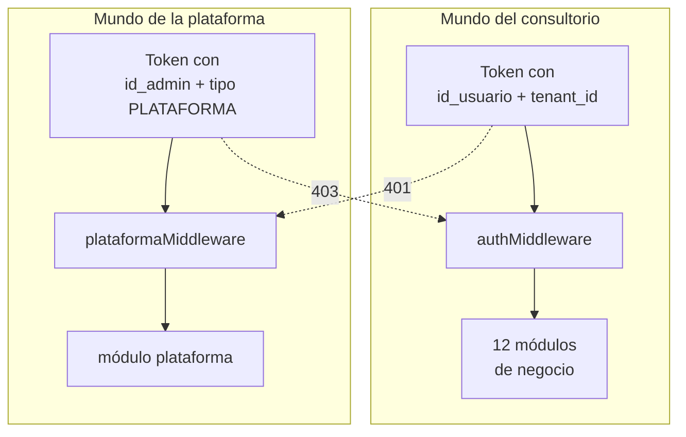
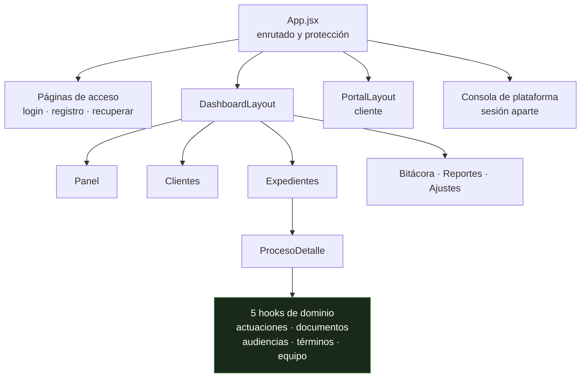

# 08 — Diagrama de componentes

**Qué responde:** de qué piezas se compone el sistema y quién habla con quién.

---

## Vista general



---

## Los 13 módulos de la API

Cada uno es una carpeta con dos archivos: sus rutas y su controlador.

| Módulo | Endpoints | De qué responde |
|---|---:|---|
| `auth` | 11 | Registro, acceso, 2FA, verificación, recuperación y cierre de sesión |
| `procesos` | 10 | Expedientes, equipo, estados, partes |
| `documentos` | 8 | Carga, versiones, visibilidad, descarga |
| `plataforma` | 6 | **Administración del servicio, aislada** |
| `admin` | 6 | Usuarios, permisos y bitácora del consultorio (con exportación) |
| `clientes` | 5 | Clientes y acceso al portal |
| `actuaciones` | 4 | Actos del juzgado |
| `audiencias` | 4 | Agenda |
| `terminos` | 4 | Plazos y su gestión |
| `reportes` | 3 | Estadísticas y exportación en CSV y PDF |
| `notificaciones` | 2 | Centro de alertas |
| `portal` | 2 | Vista restringida del cliente |
| `tenant` | 2 | Perfil del consultorio |

**67 endpoints.** Recuento reproducible:

```bash
grep -rhoE "router\.(get|post|put|patch|delete)\(" backend/src/modules/*/*.routes.js | wc -l
```

---

## La cadena de middlewares

Toda petición atraviesa lo mismo, en este orden. **El orden importa**: cada capa asume que la
anterior ya hizo su trabajo.



**`authMiddleware` es la pieza crítica del sistema.** Además de autenticar:

1. Comprueba que el usuario esté activo.
2. Comprueba que **su consultorio** esté activo — la palanca de suspensión.
3. Rechaza los tokens de plataforma con 403.
4. **Inyecta `req.tenant_id`**, que todas las consultas usan para filtrar.

Sin el punto 4, el aislamiento entre consultorios no existiría.

---

## Los dos mundos de autenticación



Las dos flechas punteadas son la garantía: **cada middleware rechaza los tokens del otro**. Están
verificadas por las comprobaciones P-03 y P-04 de `npm run verificar:plataforma`.

---

## Piezas transversales

| Componente | Qué hace | Por qué está separado |
|---|---|---|
| `mailer.js` | Envío de correo | Admite SMTP propio o Gmail como respaldo. Cambiar de proveedor es tocar el `.env`, no el código |
| `cloudflare.js` | Cliente de almacenamiento | Aísla el proveedor de archivos del resto |
| `subida.middleware.js` | Traduce errores de subida | Los fallos de tamaño y formato ocurren **antes** del controlador; sin esta pieza acababan en un 500 genérico |
| `recordatorios.job.js` | El cron de alertas | Corre dentro del proceso de la API ([ADR-007](../../docs/11-DECISIONES-ARQUITECTONICAS.md)) |
| `terminos.utils.js` | Semáforo y cuenta atrás | Funciones puras: se razonan y prueban sin montar la interfaz |

---

## Frontend



**`ProcesoDetalle` concentraba el 36 % del frontend** en un solo archivo: 3 094 líneas y 76
piezas de estado. Se repartió en cinco *hooks* de dominio, quedando en 2 522 líneas y 8 estados.

La restricción que lo hizo seguro: **cada hook devuelve los mismos nombres de variable** que
había en el componente, de modo que las 2 300 líneas de interfaz no se tocaron. Se movió estado;
no se reescribió la pantalla.
