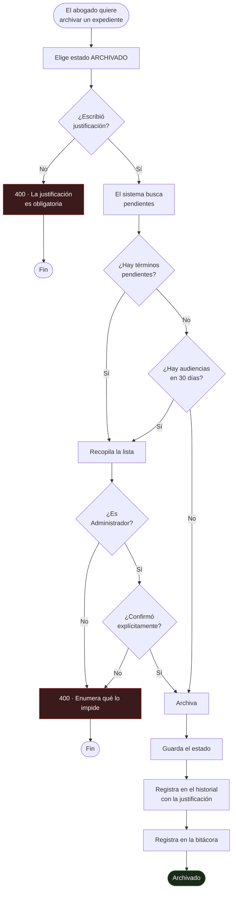
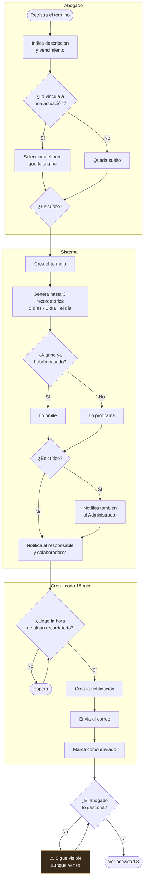
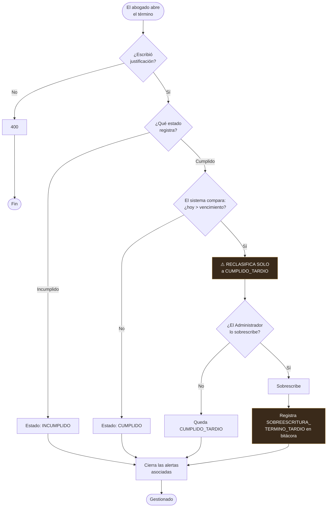
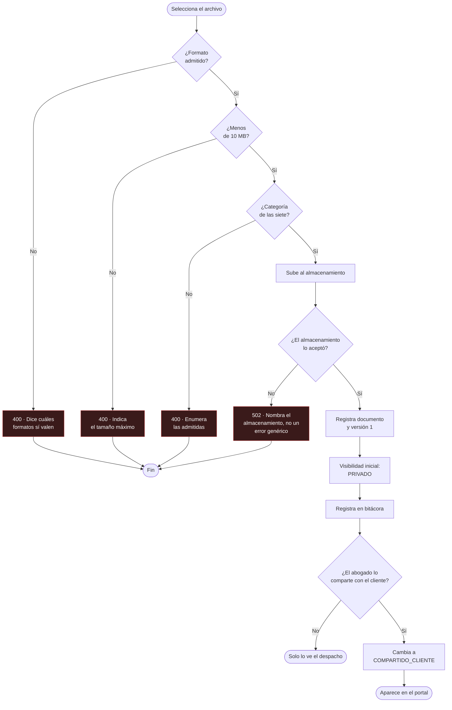
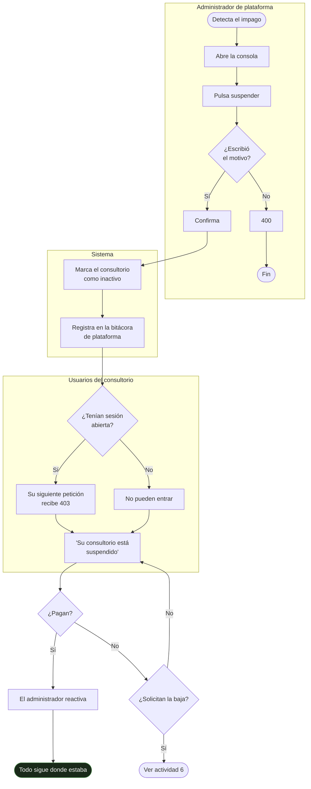
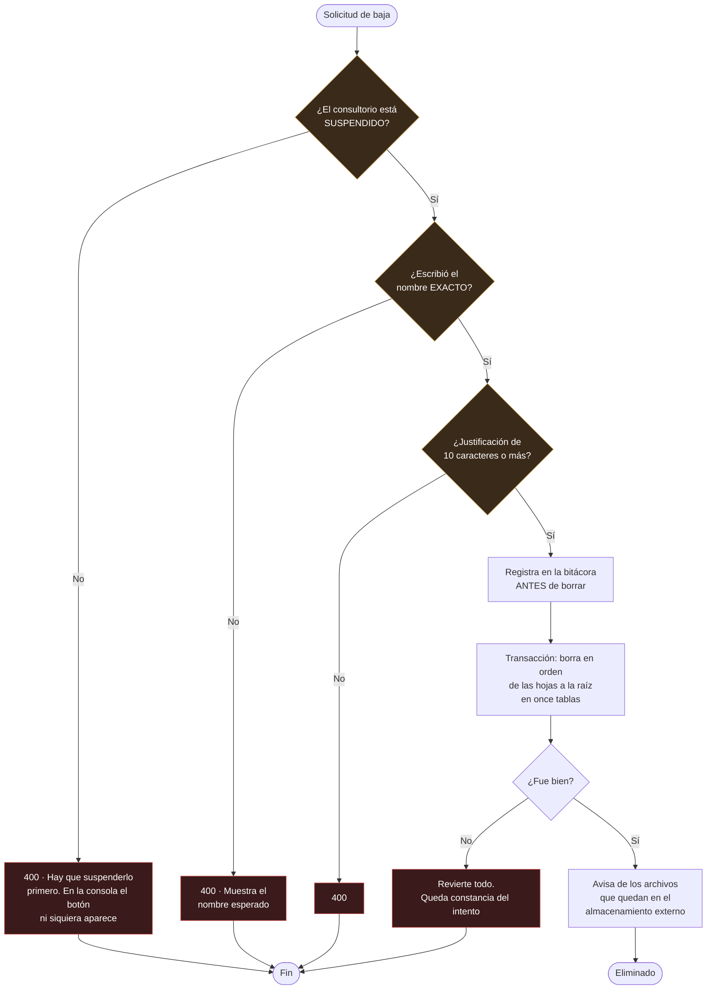

# 09 — Diagrama de actividades

**Qué responde:** los procesos completos con sus decisiones, bifurcaciones y quién hace cada
paso.

> **Diferencia con el diagrama de flujo.** Aquel muestra el recorrido feliz; este muestra **todas
> las ramas**, incluidas las que terminan en rechazo. Las calles verticales indican quién ejecuta
> cada paso.

---

## 1. Archivar un expediente

El proceso con más reglas del sistema.

**La rama que importa** es la de la derecha: cuando hay pendientes, el sistema **no dice
simplemente que no**. Devuelve la lista de qué lo impide, y solo entonces el Administrador puede
decidir forzarlo. Archivar apaga la vigilancia de los plazos; tiene que ser una decisión
consciente (RN05).

---

## 2. Registrar y vigilar un término

> **El bucle de la parte inferior es intencional.** Un término vencido **no desaparece**: sigue
> visible y sigue reclamando atención hasta que alguien lo gestione. Un plazo vencido es justo lo
> que no debe dejar de verse (RF34).

---

## 3. Gestionar el cumplimiento — la regla RN07

**La reclasificación ocurre en el servidor y no se puede evitar desde la interfaz.** Es la regla
con más peso jurídico del sistema: un término es **perentorio**, y cumplirlo tarde no es
cumplirlo. Registrarlo como cumplido a secas falsearía el historial del caso, que es
exactamente lo que se discutiría en una reclamación de responsabilidad profesional.

---

## 4. Subir un documento y compartirlo

**Las cuatro ramas de rechazo dicen qué corregir.** Las de formato y tamaño devolvían el mismo
`500 "Algo salió mal!"` hasta el 2 de septiembre de 2026, porque la validación de multer ocurre
**antes** del controlador y su `try/catch` nunca llegaba a ejecutarse. La de categoría se añadió
el 3 de septiembre: una categoría inexistente viajaba sin validar hasta Prisma y volvía con el
mismo error opaco.

---

## 5. Suspender un consultorio por impago

> **Suspender no borra nada.** Al reactivar, todo sigue donde estaba. Es lo que permite usarlo
> como palanca de cobro sin riesgo para los expedientes del despacho.

---

## 6. Dar de baja un consultorio — los tres cerrojos

**Los tres cerrojos son deliberados y ninguno es decorativo.** Esto borra expedientes judiciales:
para un despacho, perderlos puede tener consecuencias legales frente a sus propios clientes.

- **El primero** obliga a que exista un periodo en el que el consultorio ya no entra pero sus
  datos siguen ahí. Es el margen para rectificar.
- **El segundo** evita eliminar el de la fila de al lado.
- **El tercero** deja escrito por qué se hizo.

Y la bitácora se escribe **antes** de borrar, fuera de la transacción: si el borrado fallara a
medias, queda constancia del intento. Su tabla no cuelga del consultorio, así que sobrevive a su
desaparición.
