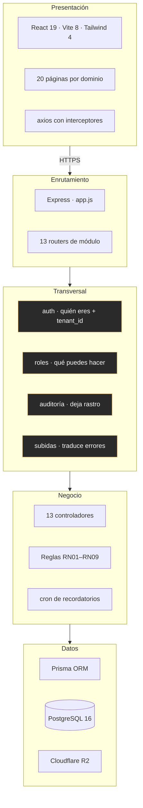
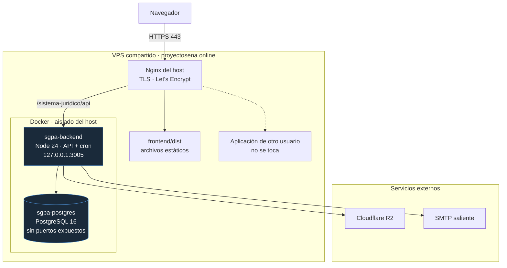
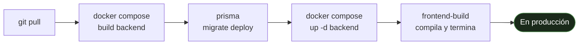

# 10 — Arquitectura y despliegue

**Qué responde:** cómo está organizado el sistema por dentro y cómo corre en el servidor.

---

## 1. Arquitectura en capas

**El SGPA es un monolito modular.** Un proceso, una base de datos, un despliegue, organizado por
dominio de negocio.



> **No es MVC**, y conviene decirlo con precisión. No hay carpetas `controllers/`, `models/` y
> `views/`. La organización es **por dominio**: todo lo de expedientes vive junto. Un
> desarrollador nuevo entiende «expedientes» abriendo dos archivos contiguos.
>
> **Tampoco es microservicios**, aunque documentación anterior del proyecto lo llamara así.
> Microservicios implica servicios desplegables por separado, comunicación entre procesos y
> bases de datos independientes. Nada de eso existe ([ADR-001](../../docs/11-DECISIONES-ARQUITECTONICAS.md)).

---

## 2. Organización del código

```
backend/src/
├── app.js                    ← monta los 13 módulos
├── config/                   ← prisma · cloudflare · mailer · webhook
├── middlewares/              ← auth · roles · audit · subida · plataforma
├── jobs/
│   └── recordatorios.job.js  ← el cron, cada 15 minutos
├── utils/                    ← jwt · bcrypt · password
└── modules/
    └── <dominio>/
        ├── <dominio>.routes.js
        └── <dominio>.controller.js

frontend/src/
├── App.jsx                   ← enrutado y rutas protegidas
├── api/                      ← axios: consultorio y plataforma, separados
├── components/layout/
├── lib/utils.js              ← funciones compartidas
└── pages/<dominio>/
```

---

## 3. Despliegue

El sistema corre en un **VPS compartido con otra aplicación** de otro usuario, que depende de
una versión distinta de Node. Ese hecho determinó la arquitectura de despliegue.



### Por qué contenedores

Antes de esta decisión, actualizar Node para el SGPA **rompía la aplicación del otro usuario**,
que estaba construida sobre la versión anterior. Un despliegue obligaba a elegir entre quedarse
atrás o romperle el servicio a alguien.

Al fijar la versión dentro de la imagen, el SGPA deja de depender del Node del sistema
([ADR-011](../../docs/11-DECISIONES-ARQUITECTONICAS.md)).

### Dos detalles de seguridad que no son casuales

**`127.0.0.1:3005` y no `0.0.0.0`.** Sin esa restricción, Docker abre el puerto a internet
**saltándose el cortafuegos del VPS**. Solo el Nginx del host puede alcanzar la API.

**PostgreSQL sin ningún puerto publicado.** La base de datos solo es alcanzable desde la red
interna del compose. Ni siquiera desde el propio servidor.

---

## 4. Cómo se despliega



**El orden importa.** La migración se ejecuta con la imagen **ya reconstruida**: si se hiciera
antes, el contenedor viejo no tendría el archivo de migración y el comando no haría nada.

El contenedor `frontend-build` no queda corriendo: compila, deja los archivos en `frontend/dist`
y termina. El Nginx del host los sirve directamente.

Procedimiento completo, incluida la configuración de Nginx, en
[12-DESPLIEGUE-VPS-COMPARTIDO.md](../../docs/12-DESPLIEGUE-VPS-COMPARTIDO.md).

---

## 5. Comprobar que funciona

```bash
npm --prefix backend test                    # 110 pruebas
npm --prefix backend run verificar           # 34 comprobaciones sobre la plataforma
npm --prefix backend run verificar:plataforma # 16 de la administración del servicio
npm --prefix backend run lint                # 0 errores
```

Y sobre el servidor:

```bash
docker compose exec backend node -r dotenv/config scripts/probar-correo.js CORREO
docker compose exec backend node -r dotenv/config scripts/probar-almacenamiento.js
docker compose ps
```

Los dos primeros dicen en segundos si el correo y los archivos funcionan. El tercero, si los
contenedores están vivos.

---

## 6. Limitaciones declaradas del despliegue

| Limitación | Consecuencia | Requisito |
|---|---|---|
| **Sin respaldos automáticos** de la base de datos | Si el volumen se corrompe, se pierden todos los expedientes | RNF10.3 |
| Sin monitoreo | La disponibilidad **no se puede afirmar** porque no se mide | RNF07.2 |
| Sin pruebas de carga | La concurrencia nunca se ha medido | RNF08 |
| El cron vive dentro de la API | Si el proceso cae, se detienen también las alertas | [ADR-007](../../docs/11-DECISIONES-ARQUITECTONICAS.md) |
| Solo 2 índices en la base | Las búsquedas responden hoy en 5–17 ms; sin garantía al crecer | RNF05.5 |

> **La primera es la más grave**, y apareció al revisar RNF10: al pasar la base de datos a un
> contenedor propio se ganó aislamiento y **se perdió el respaldo automático** que daba el
> proveedor gestionado anterior, sin poner nada en su lugar. Hay procedimiento manual
> documentado y la automatización está definida pero no instalada.
