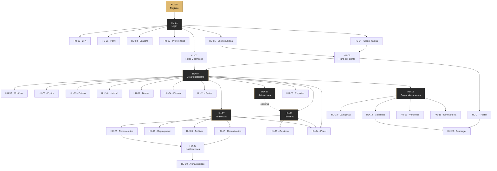

# 05 — Historias de usuario

**37 historias.** Cada una es una **ficha autocontenida**: el texto de los requisitos de los que
nace está *aquí mismo*, no en otro archivo.

---

## Cómo leer una ficha

```
HU-xx · Título                          ← identificador y qué hace
Actor · Sprint · Puntos · Estado

NACE DE                                 ← los requisitos, CON SU TEXTO COMPLETO
REGLA QUE LA GOBIERNA                   ← si aplica
DEPENDE DE  →  qué necesita antes       ← el grafo, explicado
HABILITA    →  qué desbloquea
CRITERIOS DE ACEPTACIÓN
DÓNDE ESTÁ  →  endpoint y archivo
CÓMO DEMOSTRARLO  →  ruta en pantalla
```

La última línea existe para cuando pidan *«enséñemelo funcionando»*.

---

## Grafo de dependencias

Una historia **depende** de otra cuando es **literalmente imposible** ejecutarla sin ella: no
se puede crear un expediente sin un cliente, ni clasificar un documento sin haberlo subido.



**Cómo leerlo.** HU-35 (en dorado) es la raíz: no depende de nada. Las cajas resaltadas son los
**cuellos de botella**: si HU-07 no funciona, catorce historias quedan inalcanzables.

### Tabla de dependencias

| Historia | Depende de | Por qué |
|---|---|---|
| HU-35 Registro | — | Raíz del sistema |
| HU-01 Login | HU-35 | Hace falta una cuenta |
| HU-02, HU-03, HU-04, HU-05, HU-29, HU-32, HU-36 | HU-01 | Exigen sesión iniciada |
| HU-06 Ficha del cliente | HU-04 o HU-05 | Hace falta un cliente |
| HU-07 Crear expediente | HU-06, HU-02 | Exige cliente y abogado responsable |
| HU-08…HU-11, HU-31, HU-33, HU-34, HU-37 | HU-07 | Operan sobre un expediente |
| HU-12 Cargar documentos | HU-07 | El documento se adjunta a un expediente |
| HU-13, HU-14, HU-15, HU-16 | HU-12 | Necesitan un documento cargado |
| HU-17 Audiencias | HU-07 | La audiencia pertenece a un expediente |
| HU-18, HU-19, HU-20 | HU-17 | Operan sobre una audiencia |
| HU-21 Términos | HU-07 · *(HU-37 opcional)* | El término pertenece a un expediente; **puede** vincularse a una actuación |
| HU-22, HU-23 | HU-21 | Operan sobre un término |
| HU-24 Panel | HU-07, HU-17, HU-21 | Sin datos no hay nada que priorizar |
| HU-25 Notificaciones | HU-18, HU-22 | Las alertas nacen de los recordatorios |
| HU-30 Alertas críticas | HU-25 | Gestiona notificaciones existentes |
| HU-26 Reportes | HU-07 | Agrega datos de expedientes |
| HU-27 Portal | HU-06 | El acceso se habilita desde la ficha del cliente |
| HU-28 Descargar | HU-27, HU-14 | Exige portal y documento marcado como compartido |

> **La única dependencia opcional** es HU-37 → HU-21: un término **puede** nacer de una actuación,
> pero también registrarse suelto. Es la línea punteada del grafo.

---

# Módulo 1 · Acceso y cuenta

## HU-35 · Registro en la plataforma
**Actor:** Visitante · **Sprint 1** · **8 pts** · ✅

**Nace de estos requisitos**
- **RF51** — Registro público de nuevos consultorios; la cuenta queda **inactiva** hasta verificar el correo.
- **RF54** — Enlace de verificación único, tokenizado, vigente 24 horas, de un solo uso y reenviable.

**Depende de** — *(raíz: no depende de nada)*
**Habilita** → HU-01 y, por transitividad, todo el sistema

**Criterios de aceptación**
1. Se elige entre consultorio o abogado independiente.
2. La cuenta se crea inactiva y no permite entrar hasta verificar el correo.
3. Se envía un correo con enlace de verificación único.
4. El enlace caduca a las 24 horas y solo sirve una vez.
5. Se puede solicitar el reenvío del correo.
6. Si el envío falla, **la cuenta no se destruye**: se informa del fallo.

**Dónde está** `POST /api/auth/registro` · `auth.controller.js`
**Cómo demostrarlo** Pantalla de acceso → «Regístrate aquí»

> El criterio 6 se añadió tras un defecto real: si el correo fallaba, la cuenta quedaba creada e
> inservible y el correo ya figuraba como usado, así que no se podía reintentar.

---

## HU-01 · Inicio de sesión
**Actor:** Todos · **Sprint 1** · **5 pts** · 🟡

**Nace de estos requisitos**
- **RF01** — Inicio de sesión con correo **o nombre de usuario** y contraseña.
- **RNF01** — Cifrado en tránsito TLS 1.2 o superior.
- **RNF02** — Política de contraseñas, bloqueo por intentos, sesión de 8 horas, 2FA de 5 minutos.

**Depende de** → HU-35 · **Habilita** → HU-02, HU-03, HU-04, HU-05, HU-29, HU-32, HU-36

**Criterios de aceptación**
1. El formulario acepta correo o nombre de usuario. → **🟥 solo correo**
2. Las credenciales correctas llevan al módulo que corresponde al rol.
3. Las incorrectas muestran un error genérico, sin decir qué campo falló.
4. Tras 5 intentos fallidos la cuenta se bloquea temporalmente.
5. Existe recuperación de contraseña por correo.
6. La contraseña exige mínimo 8 caracteres, mayúscula, número y carácter especial.
7. La sesión se cierra tras 30 minutos de inactividad. → **🟥 no implementado**
8. El token vence a las 8 horas.

**Dónde está** `POST /api/auth/login` · `auth.controller.js`
**Cómo demostrarlo** Fallar la contraseña 5 veces y ver el bloqueo con cuenta atrás

> El criterio 1 **no se cumple y se declara**: no existe campo de nombre de usuario en el modelo.
> El criterio 5 se implementó el 2 de septiembre de 2026; antes el enlace no funcionaba.

---

## HU-32 · Doble factor de autenticación
**Actor:** Todos · **Sprint 1** · **5 pts** · ✅

**Nace de** **RNF02** — *…2FA con vigencia de 5 minutos.*

**Depende de** → HU-01

**Criterios**
1. Cada usuario activa o desactiva el 2FA en su perfil.
2. Con 2FA activo, el login pide un código de 6 dígitos.
3. El código llega por correo y vence a los 5 minutos.
4. Un código incorrecto o vencido no da acceso.

**Dónde está** `POST /api/auth/2fa/configurar` y `/2fa/verificar`
**Cómo demostrarlo** Ajustes → activar 2FA → cerrar sesión → volver a entrar

---

## HU-36 · Perfil del consultorio
**Actor:** Administrador · **Sprint 1** · **3 pts** · ✅

**Nace de** **RF53** — El Administrador actualiza los datos del consultorio y puede cargar un logotipo.

**Depende de** → HU-01

**Criterios**
1. Se editan nombre, razón social, NIT, teléfono, dirección y ciudad.
2. Se carga un logotipo en JPG, PNG o WebP, hasta 5 MB.
3. Un archivo no admitido devuelve un mensaje que dice **qué formatos sí valen**.
4. El cambio queda en la bitácora.

**Dónde está** `PUT /api/tenant/perfil` · **Cómo demostrarlo** Ajustes → Perfil del consultorio

---

## HU-02 · Roles y permisos por módulo
**Actor:** Administrador · **Sprint 1** · **8 pts** · 🟡

**Nace de estos requisitos**
- **RF02** — Cuatro roles: Administrador, Abogado, Colaborador y Cliente.
- **RF03** — Permisos de leer, crear, editar y eliminar por cada módulo.
- **RF04** — El abogado solo ve los procesos que tiene asignados.
- **RF05** — Bitácora con usuario, fecha y hora, IP, módulo y detalle.

**Regla que la gobierna** — **RN02**: el Administrador no puede editar la bitácora, ni cerrar
alertas críticas ajenas, ni suplantar al cliente en el portal.

**Depende de** → HU-01 · **Habilita** → HU-07

**Criterios**
1. Existen los cuatro roles.
2. Los permisos se asignan por módulo y por tipo de acción.
3. El Abogado solo ve sus procesos asignados.
4. El Colaborador accede solo a lo asignado.
5. El Cliente accede solo a su portal.
6. Cambiar permisos queda en la bitácora.
7. El único Administrador no puede quitarse su propio rol. → **🟥 no validado**

**Dónde está** `PUT /api/admin/permisos/:id` · `roles.middleware.js`
**Cómo demostrarlo** Control de acceso → seleccionar usuario → ajustar permisos

---

## HU-03 · Bitácora de auditoría
**Actor:** Administrador · **Sprint 1** · **5 pts** · 🟡

**Nace de**
- **RF05** — Bitácora con usuario, fecha y hora, IP, módulo y detalle.
- **RNF03** — Bitácora inmutable, conservada 5 años, exportable con filtros.

**Regla que la gobierna** — **RN01**: la bitácora es de solo lectura para todos, incluido el
Administrador.

**Depende de** → HU-01

**Criterios**
1. Toda acción de creación, modificación o borrado se registra.
2. Cada registro guarda usuario, fecha, IP, módulo y detalle.
3. La IP es la **real del cliente**, no la del servidor intermedio.
4. El detalle se lee en lenguaje llano, no como ruta técnica.
5. Nadie puede editar ni borrar registros.
6. Se puede exportar. → **🟥 no implementado**
7. El inicio de sesión queda registrado. → **🟥 no implementado**

**Dónde está** `audit.middleware.js` · `GET /api/admin/auditoria`
**Cómo demostrarlo** Crear un cliente → Bitácora de auditoría → ver *«Registró el cliente…»*

> El criterio 4 se corrigió el 2 de septiembre de 2026: antes decía
> *«Acción CREAR realizada en /api/clientes»*, que no significa nada para un abogado.

---

## HU-29 · Preferencias de notificación
**Actor:** Todos · **Sprint 4** · **4 pts** · ✅

**Nace de**
- **RF47** — Canal configurable; agrupar más de 5 alertas en 10 minutos.
- **RF48** — Tres prioridades; la alta no se puede desactivar.

**Depende de** → HU-01

**Criterios**
1. Se elige canal: correo, plataforma o ambos.
2. Se ajusta la prioridad por tipo de evento.
3. Las alertas de prioridad alta no se pueden silenciar.

**Dónde está** `PUT /api/auth/preferencias` · **Cómo demostrarlo** Ajustes → Notificaciones

---

# Módulo 2 · Clientes

## HU-04 · Registrar cliente persona natural
**Actor:** Abogado, Colaborador · **Sprint 1** · **3 pts** · 🟡

**Nace de**
- **RF06** — Campos mínimos según persona natural o jurídica.
- **RF05** — Bitácora con usuario, fecha y hora, IP, módulo y detalle.

**Depende de** → HU-01 · **Habilita** → HU-06

**Criterios**
1. Se registran nombre, tipo y número de documento, teléfono, correo y dirección.
2. El número de documento no se repite **dentro del consultorio**.
3. **Sí** puede repetirse en otro consultorio distinto.
4. El registro queda en la bitácora.
5. Los campos obligatorios se validan en el servidor. → **🟡 parcial**

**Dónde está** `POST /api/clientes` · **Cómo demostrarlo** Clientes → Nuevo cliente → Natural

> El criterio 3 se corrigió el 2 de septiembre de 2026. Antes el documento era único en todo el
> sistema, así que una persona no podía ser cliente de dos despachos.

---

## HU-05 · Registrar cliente persona jurídica
**Actor:** Abogado, Colaborador · **Sprint 1** · **3 pts** · 🟡

**Nace de** los mismos **RF06** y **RF05** que HU-04.
**Depende de** → HU-01 · **Habilita** → HU-06

**Criterios**
1. Se registran razón social, NIT y representante legal, además de los datos de contacto.
2. La interfaz cambia los campos según el tipo elegido.
3. Resto igual que HU-04.

**Dónde está** `POST /api/clientes` · **Cómo demostrarlo** Clientes → Nuevo cliente → Jurídica

---

## HU-06 · Ficha del cliente
**Actor:** Abogado, Colaborador · **Sprint 1** · **3 pts** · ✅

**Nace de**
- **RF07** — Un cliente asociado a múltiples procesos.
- **RF08** — Ver todos los procesos del cliente desde su ficha.
- **RNF06** — Eliminación definitiva solo por Administrador con confirmación en dos pasos.
- **RNF10** — Transacciones atómicas e integridad referencial.

**Depende de** → HU-04 o HU-05 · **Habilita** → HU-07, HU-27

**Criterios**
1. La ficha muestra todos los datos del cliente.
2. Lista todos sus expedientes.
3. Cada expediente enlaza a su detalle.
4. Desde la ficha se puede abrir un expediente nuevo.
5. Se puede habilitar el acceso al portal.

**Dónde está** `GET /api/clientes/:id` · **Cómo demostrarlo** Clientes → seleccionar uno

---

# Módulo 3 · Expedientes

## HU-07 · Crear expediente jurídico digital
**Actor:** Abogado · **Sprint 1** · **8 pts** · ✅

> **Historia clave.** Catorce historias dependen de esta.

**Nace de**
- **RF09** — Crear expediente asociado a un radicado.
- **RF10** — Validar que el radicado no esté duplicado.
- **RF11** — Registrar juzgado, tipo, clase, área, estado, fecha y abogado responsable.
- **RF05** — Bitácora con usuario, fecha y hora, IP, módulo y detalle.

**Depende de** → HU-06 (un cliente), HU-02 (un abogado responsable)
**Habilita** → HU-08, HU-09, HU-10, HU-11, HU-12, HU-17, HU-21, HU-24, HU-26, HU-31, HU-33, HU-34, HU-37

**Criterios**
1. Se crea con número de radicado, cliente y abogado responsable.
2. Se registran juzgado, tipo de proceso, clase, área del derecho y fecha de radicación.
3. No se admite un radicado repetido **en el mismo consultorio**.
4. **Sí** se admite el mismo radicado en otro consultorio.
5. El estado inicial es activo.
6. La creación queda en la bitácora.

**Dónde está** `POST /api/procesos` · **Cómo demostrarlo** Expedientes → Nuevo radicado

> El criterio 4 no es un descuido: en un mismo proceso judicial **la contraparte litiga con el
> mismo radicado** desde otro despacho. Impedirlo era un error de dominio, corregido el 2 de
> septiembre de 2026.

---

## HU-33 · Modificar el expediente
**Actor:** Abogado · **Sprint 1** · **3 pts** · ✅

**Nace de** **RF11** y **RF05** *(textos en HU-07)*
**Depende de** → HU-07

**Criterios**
1. Se editan juzgado, clase, área del derecho y fecha de radicación.
2. **El radicado no se puede modificar.**
3. Cada cambio queda en el historial con valor anterior y nuevo.

**Dónde está** `PUT /api/procesos/:id` · **Cómo demostrarlo** Expediente → Editar Datos

---

## HU-08 · Equipo de trabajo del expediente
**Actor:** Administrador, Abogado · **Sprint 2** · **5 pts** · 🟡

**Nace de** **RF12** — Asignar múltiples abogados o colaboradores.
**Regla que la gobierna** — **RN04**: un proceso siempre debe tener al menos un abogado responsable.

**Depende de** → HU-07

**Criterios**
1. Se asignan varios abogados o colaboradores.
2. Cada asignación indica su rol en el proceso.
3. No se puede dejar el expediente sin responsable. → **🟡 garantizado por el modelo, no validado al cambiarlo**
4. Asignar y retirar queda en el historial.

**Dónde está** `POST /api/procesos/:id/abogados` · **Cómo demostrarlo** Expediente → Equipo de trabajo

---

## HU-09 · Cambiar el estado del proceso
**Actor:** Abogado, Administrador · **Sprint 2** · **5 pts** · ✅

**Nace de**
- **RF13** — Modificar estado: activo, archivado, suspendido o finalizado.
- **RF14** — Mantener historial de cambios.

**Reglas que la gobiernan**
- **RN03** — Un proceso finalizado o archivado no vuelve a activo sin autorización del Administrador y justificación escrita.
- **RN05** — No archivar con términos vencidos sin gestionar ni audiencias en 30 días.

**Depende de** → HU-07

**Criterios**
1. Los estados son activo, suspendido, archivado y finalizado.
2. Todo cambio exige justificación escrita.
3. No se archiva con términos pendientes o audiencias próximas.
4. El sistema **enumera** qué lo impide.
5. El Administrador puede forzarlo de forma explícita.
6. Reactivar un proceso cerrado exige rol Administrador.

**Dónde está** `PUT /api/procesos/:id/estado`
**Cómo demostrarlo** Crear un término pendiente → intentar archivar → ver el bloqueo con la lista

---

## HU-10 · Historial de cambios
**Actor:** Todos los del despacho · **Sprint 2** · **3 pts** · ✅

**Nace de** **RF14** — Mantener historial de cambios · **RNF03** — Bitácora inmutable.
**Depende de** → HU-07

**Criterios**
1. Cada modificación registra campo, valor anterior, valor nuevo, autor y fecha.
2. Se consulta desde el expediente en orden cronológico inverso.

**Dónde está** `GET /api/procesos/:id` · **Cómo demostrarlo** Expediente → Bitácora de Cambios

---

## HU-31 · Buscar y filtrar expedientes
**Actor:** Todos los del despacho · **Sprint 2** · **5 pts** · 🟡

**Nace de**
- **RNF05** — Búsqueda por 6 campos, menos de 2 s, texto parcial desde 3 caracteres, filtros combinables, paginación de 20.
- **RNF08** — 50 usuarios concurrentes; consultas por debajo de 3 s.

**Depende de** → HU-07

**Criterios**
1. Busca por radicado, juzgado, nombre de cliente y abogado responsable.
2. El texto parcial se aplica desde 3 caracteres.
3. Los filtros de estado y tipo se combinan con la búsqueda.
4. Los resultados se paginan de 20 en 20.
5. Responde en menos de 2 segundos. → **🟡 hoy sí (5–17 ms), sin índices que lo garanticen al crecer**

**Dónde está** `GET /api/procesos` · **Cómo demostrarlo** Expedientes → buscar por radicado parcial

---

## HU-34 · Eliminar definitivamente un expediente
**Actor:** Administrador · **Sprint 2** · **3 pts** · ✅

**Nace de**
- **RNF06** — Eliminación definitiva solo por Administrador con confirmación en dos pasos.
- **RNF10** — Transacciones atómicas e integridad referencial.
- **RF05** — Bitácora.

**Depende de** → HU-07

**Criterios**
1. Solo el Administrador puede hacerlo.
2. Exige justificación escrita.
3. Se bloquea si hay documentos activos o términos pendientes.
4. Elimina en cascada todo lo asociado, en una sola transacción.
5. Queda en la bitácora.

**Dónde está** `DELETE /api/procesos/:id`
**Cómo demostrarlo** Expediente sin pendientes → Eliminar definitivamente

---

## HU-11 · Partes procesales
**Actor:** Abogado, Colaborador · **Sprint 2** · **5 pts** · 🟡

**Nace de**
- **RF15** — Registrar demandante, demandado, víctima, tercero, cliente y otros.
- **RF16** — Permitir crear procesos sin todas las partes.
- **RF17** — Marcar incompleto el proceso sin demandante y demandado, con aviso en el panel y en la ficha.

**Depende de** → HU-07

**Criterios**
1. Se registran los seis tipos de parte.
2. Un expediente puede crearse sin todas las partes.
3. Sin demandante y demandado se marca como incompleto.
4. El aviso aparece en la ficha del expediente.
5. El aviso aparece en el panel principal. → **🟥 no implementado**

**Dónde está** `POST /api/procesos/:id/partes` · **Cómo demostrarlo** Expediente → Partes Procesales

---

## HU-37 · Actuaciones procesales
**Actor:** Abogado, Colaborador · **Sprint 2** · **5 pts** · ✅

> **Historia recuperada.** La entidad Actuación existía en la investigación original y
> desapareció al reescribir los requisitos, sin que nadie lo notara. Ver
> [ADR-010](../../docs/11-DECISIONES-ARQUITECTONICAS.md).

**Nace de**
- **RF55** — Registrar actuaciones con fecha, tipo y anotación.
- **RF56** — El tipo proviene de un catálogo cerrado de diez valores.
- **RF57** — Orden cronológico inverso; distinguir fecha de la actuación y fecha de registro.
- **RF58** — Vincular un término judicial con la actuación que lo originó.
- **RF59** — Eliminación restringida al Administrador y bloqueada si tiene términos asociados.

**Depende de** → HU-07 · **Habilita** → HU-21 *(de forma opcional)*

**Criterios**
1. Se registra con fecha, tipo y anotación obligatoria.
2. El tipo sale de un catálogo cerrado de diez valores.
3. Un tipo fuera del catálogo se rechaza.
4. Se listan en orden cronológico inverso.
5. Se distingue la fecha de la actuación de la fecha de registro.
6. La fecha no se desplaza un día al mostrarse.
7. Un término se puede vincular a la actuación que lo originó.
8. La actuación muestra los términos que originó.
9. Solo el Administrador la elimina.
10. No se elimina si tiene términos asociados.

**Dónde está** `POST /api/actuaciones` · `actuaciones.controller.js`
**Cómo demostrarlo** Expediente → pestaña Actuaciones → Registrar Actuación

> Esta historia cierra la cadena **actuación → término → alerta**, que es el recorrido real del
> problema: del juzgado sale un auto, del auto nace un plazo, del plazo debe salir un aviso.

---

# Módulo 4 · Documentos

## HU-12 · Cargar documentos
**Actor:** Abogado, Colaborador · **Sprint 2** · **5 pts** · ✅

**Nace de**
- **RF18** — Formatos PDF, DOCX, XLSX, JPG y PNG, máximo 10 MB, con error descriptivo.
- **RF20** — Organización cronológica por fecha y hora de carga.
- **RF24** — Historial de creación, modificación y eliminación.

**Depende de** → HU-07 · **Habilita** → HU-13, HU-14, HU-15, HU-16

**Criterios**
1. Se sube un archivo con nombre, categoría y visibilidad.
2. Se admiten los formatos del catálogo; el resto se rechaza **diciendo cuáles valen**.
3. El límite es 10 MB, y superarlo devuelve un mensaje claro.
4. La carga queda en la bitácora.

**Dónde está** `POST /api/documentos` · **Cómo demostrarlo** Expediente → Documentos → Subir Archivo

> Hasta el 2 de septiembre de 2026 **no había filtro de formatos**: se podía adjuntar un
> ejecutable a un expediente judicial. Y los errores de tamaño devolvían un 500 sin explicación.

---

## HU-13 · Clasificar documentos
**Actor:** Abogado, Colaborador · **Sprint 2** · **3 pts** · 🟡

**Nace de**
- **RF19** — Siete categorías: demandas, pruebas, contratos, escritos, notificaciones, providencias y otros.
- **RF20** — Organización cronológica.
- **RF21** — Documentos generales no vinculados a un proceso.

**Depende de** → HU-12

**Criterios**
1. Cada documento se clasifica en una categoría.
2. Existen las siete categorías. → **🟥 falta «escritos»**
3. Se filtra por categoría.
4. Se pueden cargar documentos sin expediente.

**Dónde está** `documentos.controller.js` · **Cómo demostrarlo** Expediente → Documentos → filtrar

---

## HU-14 · Visibilidad de documentos
**Actor:** Abogado · **Sprint 2** · **5 pts** · ✅

**Nace de**
- **RF22** — Visibilidad privado, compartido con cliente o visible para colaboradores.
- **RF43** — El portal muestra procesos, audiencias, documentos habilitados y novedades.
- **RF44** — El abogado define qué documentos ve el cliente.
- **RF46** — Restringir notas internas, estrategias y documentos privados.

**Depende de** → HU-12 · **Habilita** → HU-28

**Criterios**
1. Cada documento tiene una de las tres visibilidades.
2. La visibilidad se cambia después de cargarlo.
3. Solo lo marcado como compartido llega al portal del cliente.
4. Lo privado **nunca** aparece en el portal.

**Dónde está** `PATCH /api/documentos/:id/estado` · **Cómo demostrarlo** Documento → cambiar visibilidad

---

## HU-15 · Versionado documental
**Actor:** Abogado, Colaborador · **Sprint 3** · **5 pts** · ✅

**Nace de** **RF23** — Conservar todas las versiones; la activa es la más reciente.
**Regla** — **RN06**: un documento inactivo o reemplazado no puede reactivarse.
**Depende de** → HU-12

**Criterios**
1. Se sube una versión nueva sin perder la anterior.
2. La versión activa es siempre la más reciente.
3. Se consulta el historial completo de versiones.
4. Cada versión conserva quién la subió y cuándo.

**Dónde está** `POST /api/documentos/:id/version` · **Cómo demostrarlo** Documento → Nueva versión → Historial

---

## HU-16 · Eliminación de documentos
**Actor:** Abogado, Administrador · **Sprint 3** · **5 pts** · ✅

**Nace de**
- **RF25** — Restringir la eliminación de documentos usados en actuaciones.
- **RF26** — Marcar como reemplazado o inactivo sin perder trazabilidad.
- **RNF06** — Eliminación definitiva solo por Administrador con confirmación en dos pasos.

**Regla** — **RN06** · **Depende de** → HU-12

**Criterios**
1. La eliminación lógica lo oculta sin borrarlo.
2. La eliminación física exige rol Administrador y justificación.
3. Un documento inactivo o reemplazado no se reactiva.
4. Ambas quedan en la bitácora.

**Dónde está** `DELETE /api/documentos/:id` y `/definitivo`

---

# Módulo 5 · Audiencias

## HU-17 · Registrar audiencia
**Actor:** Abogado, Colaborador · **Sprint 3** · **3 pts** · ✅

**Nace de** **RF27** — Registrar audiencias y diligencias.
**Depende de** → HU-07 · **Habilita** → HU-18, HU-19, HU-20, HU-24

**Criterios**
1. Se registra con nombre, tipo, fecha y hora, y lugar.
2. Queda asociada al expediente.
3. Aparece en la agenda del expediente.

**Dónde está** `POST /api/audiencias` · **Cómo demostrarlo** Expediente → Agenda → Agendar Audiencia

---

## HU-18 · Recordatorios de audiencia
**Actor:** Abogado · **Sprint 3** · **5 pts** · ✅

**Nace de**
- **RF28** — Hasta 3 recordatorios; por defecto 48 h, 24 h y el mismo día; canal configurable.
- **RF29** — Notificar al abogado responsable y a los colaboradores.
- **RF47** — Canal configurable; agrupar más de 5 alertas en 10 minutos.

**Depende de** → HU-17 · **Habilita** → HU-25

**Criterios**
1. Se configuran hasta tres recordatorios.
2. Por defecto son 48 h, 24 h y el mismo día.
3. El canal de cada uno es configurable.
4. Llegan al responsable y a los colaboradores.

**Dónde está** `recordatorios.job.js`, cada 15 minutos

---

## HU-19 · Reprogramar audiencia
**Actor:** Abogado · **Sprint 3** · **3 pts** · ✅

**Nace de** **RF30** — Reprogramar manteniendo historial · **RF05** — Bitácora.
**Depende de** → HU-17

**Criterios**
1. Se cambian fecha, hora y lugar.
2. La reprogramación queda en el historial del expediente.
3. Los recordatorios se recalculan sobre la fecha nueva.

**Dónde está** `PUT /api/audiencias/:id`

---

## HU-20 · Archivar audiencias celebradas
**Actor:** Sistema · **Sprint 3** · **3 pts** · ✅

**Nace de** **RF31** — Mover automáticamente al historial las audiencias realizadas.
**Depende de** → HU-17

**Criterios**
1. Una audiencia pasada pasa al historial sin intervención manual.
2. Sigue consultable en el historial.

**Dónde está** `autoArchivePastHearings`, al consultar la agenda

---

# Módulo 6 · Términos judiciales

## HU-21 · Registrar término judicial
**Actor:** Abogado · **Sprint 3** · **3 pts** · ✅

**Nace de**
- **RF32** — Registrar términos manualmente con fecha de vencimiento.
- **RF34** — Mantener visibles los términos vencidos hasta su gestión manual.
- **RF37** — Hasta 3 recordatorios; los críticos alertan también al Administrador.

**Depende de** → HU-07 · *(opcionalmente HU-37, para vincularlo a su actuación)*
**Habilita** → HU-22, HU-23, HU-24

**Criterios**
1. Se registra con descripción y fecha de vencimiento.
2. Se puede marcar como crítico.
3. Un término crítico alerta también al Administrador.
4. Un término vencido **sigue visible** hasta que se gestiona.
5. Se puede vincular a la actuación que lo originó.

**Dónde está** `POST /api/terminos` · **Cómo demostrarlo** Expediente → Términos → Registrar Plazo

> El criterio 4 importa: un plazo vencido es justo lo que no debe dejar de verse.

---

## HU-22 · Recordatorios de término
**Actor:** Abogado · **Sprint 3** · **5 pts** · 🟡

**Nace de**
- **RF33** — Valores por defecto: 5 días, 1 día y el día del vencimiento.
- **RF36** — Historial completo de alertas y estados.
- **RF37** — Hasta 3 recordatorios.

**Depende de** → HU-21 · **Habilita** → HU-25

**Criterios**
1. Por defecto se crean a 5 días, 1 día y el día del vencimiento.
2. Se omiten los que ya habrían pasado.
3. Se configuran recordatorios propios en minutos, horas o días.
4. Se conserva el registro de los envíos.
5. Se conserva el historial de cambios de estado. → **🟥 solo el último**

**Dónde está** `terminos.controller.js` · `recordatorios.job.js`

---

## HU-23 · Gestionar un término
**Actor:** Abogado · **Sprint 3** · **5 pts** · ✅

**Nace de**
- **RF35** — Registrar cumplido, cumplido tardíamente o incumplido.
- **RF37** — Recordatorios y criticidad.

**Reglas que la gobiernan**
- **RN07** — Clasificación automática del término tardío, no sobrescribible salvo por el Administrador.
- **RN08** — Una alerta de prioridad alta solo la cierra su destinatario.
- **RN02** — Límites del acceso administrativo.

**Depende de** → HU-21

**Criterios**
1. Se registra como cumplido, cumplido tardíamente o incumplido.
2. La gestión exige justificación escrita.
3. **Marcarlo cumplido después del vencimiento lo reclasifica automáticamente como tardío.**
4. Sobrescribir esa clasificación exige rol Administrador y queda en la bitácora.

**Dónde está** `PUT /api/terminos/:id/gestion`
**Cómo demostrarlo** Crear un término con fecha pasada → marcarlo cumplido → ver `CUMPLIDO_TARDIO`

> El criterio 3 es la regla con más peso jurídico del sistema: un término es **perentorio**, y
> cumplirlo tarde no es cumplirlo. Está entre las 34 comprobaciones automáticas.

---

# Módulo 7 · Panel, alertas y reportes

## HU-24 · Panel principal por rol
**Actor:** Todos los del despacho · **Sprint 4** · **8 pts** · 🟡

**Nace de**
- **RF38** — Panel diferenciado por rol.
- **RF39** — Priorizar términos por vencer, vencidos y audiencias próximas.
- **RF40** — Marcar en rojo términos vencidos, audiencias en menos de 24 h y procesos sin movimiento más de 30 días.

**Regla** — **RN09**: el rojo se reserva para riesgo procesal o disciplinario; nunca decorativo.
**Depende de** → HU-07, HU-17, HU-21

**Criterios**
1. El contenido cambia según el rol.
2. Prioriza términos por vencer, vencidos y audiencias próximas.
3. Los términos vencidos se marcan en rojo.
4. Las audiencias en menos de 24 h se marcan en rojo.
5. Los procesos sin movimiento más de 30 días se marcan en rojo. → **🟥 no implementado**

**Dónde está** `DashboardIndex.jsx` · **Cómo demostrarlo** Panel principal → semáforo de riesgos

---

## HU-25 · Centro de notificaciones
**Actor:** Todos los del despacho · **Sprint 4** · **5 pts** · ✅

**Nace de**
- **RF41** — Ocultar lo gestionado tras X horas, 48 por defecto, ajustable.
- **RF47** — Canal configurable; agrupar más de 5 alertas en 10 minutos.
- **RF48** — Tres prioridades; la alta no se puede desactivar.
- **RF49** — Mantener visibles las alertas críticas hasta su gestión.
- **RF50** — Registrar historial de notificaciones enviadas.

**Depende de** → HU-18, HU-22 · **Habilita** → HU-30

**Criterios**
1. Las alertas se listan por prioridad.
2. Más de cinco en diez minutos se agrupan en una.
3. Lo gestionado se oculta pasadas 48 h, umbral ajustable.
4. Las notificaciones no se borran.

**Dónde está** `notificaciones.controller.js` · **Cómo demostrarlo** Panel → Centro de Notificaciones

---

## HU-30 · Alertas críticas
**Actor:** Abogado, Administrador · **Sprint 4** · **5 pts** · ✅

**Nace de** **RF48**, **RF49**, **RF50** *(textos en HU-25)*
**Reglas** — **RN08** y **RN02** · **Depende de** → HU-25

**Criterios**
1. Una alerta crítica permanece visible hasta gestionarse manualmente.
2. Solo la cierra su destinatario.
3. El Administrador puede cerrarla si el destinatario está inactivo.
4. El cierre queda registrado.

**Dónde está** `PUT /api/notificaciones/:id/gestionar`

---

## HU-26 · Estadísticas y reportes
**Actor:** Administrador · **Sprint 4** · **5 pts** · 🟡

**Nace de** **RF42** — Estadísticas con filtro por rango de fechas.
**Depende de** → HU-07

**Criterios**
1. Muestra estadísticas de expedientes por estado y por abogado.
2. Se filtra por mes, trimestre, año o rango propio.
3. Se exporta en CSV.
4. El CSV incluye a los clientes **sin** expedientes.
5. Se exporta en PDF. → **🟥 no implementado**

**Dónde está** `GET /api/reportes/stats` y `/export/csv` · **Cómo demostrarlo** Reportes → Exportar

> El criterio 4 nació de un defecto real: exportar con un cliente dado de alta y ningún
> expediente devolvía un archivo con solo la cabecera.

---

# Módulo 8 · Portal del cliente

## HU-27 · Acceso al portal
**Actor:** Cliente · **Sprint 4** · **5 pts** · 🟡

**Nace de**
- **RF43** — El portal muestra procesos, audiencias autorizadas, documentos habilitados y novedades.
- **RF46** — Restringir notas internas, estrategias y documentos privados.
- **RNF02** — Seguridad de credenciales y sesión.
- **RNF04** — Compatibilidad y diseño adaptable.

**Regla** — **RN02**: el Administrador no puede suplantar al cliente en el portal.
**Depende de** → HU-06 · **Habilita** → HU-28

**Criterios**
1. El acceso se habilita desde la ficha del cliente.
2. El cliente entra por la misma pantalla que el resto y ve una vista restringida.
3. Solo ve sus propios procesos.
4. Nunca ve notas internas ni documentos privados.
5. Ningún otro rol puede entrar al portal.

**Dónde está** `portal.controller.js` · **Cómo demostrarlo** Ficha del cliente → Habilitar acceso

---

## HU-28 · Descargar documentos desde el portal
**Actor:** Cliente · **Sprint 4** · **3 pts** · ✅

**Nace de**
- **RF44** — El abogado define qué documentos ve el cliente.
- **RF45** — El cliente puede descargar los documentos autorizados.
- **RF46** — Restringir lo interno.
- **RF05** — Bitácora.

**Depende de** → HU-27, HU-14

**Criterios**
1. Solo se descargan los documentos marcados como compartidos.
2. La descarga usa un enlace firmado y temporal.
3. Cada descarga queda auditada.

**Dónde está** `GET /api/documentos/download/:id_version`

---

## Resumen

| | |
|---|---:|
| Historias | 37 |
| Completas ✅ | 24 |
| Parciales 🟡, con el criterio pendiente declarado | 13 |
| Sin empezar | 0 |
| Puntos de historia | 170 |

**Los cuellos de botella del grafo** —las historias de las que más dependen otras— son HU-07
(catorce dependientes), HU-01 (siete), HU-12 (cuatro) y HU-17 (tres). Son las que conviene
demostrar primero: si funcionan, la mayor parte del sistema está en pie.
